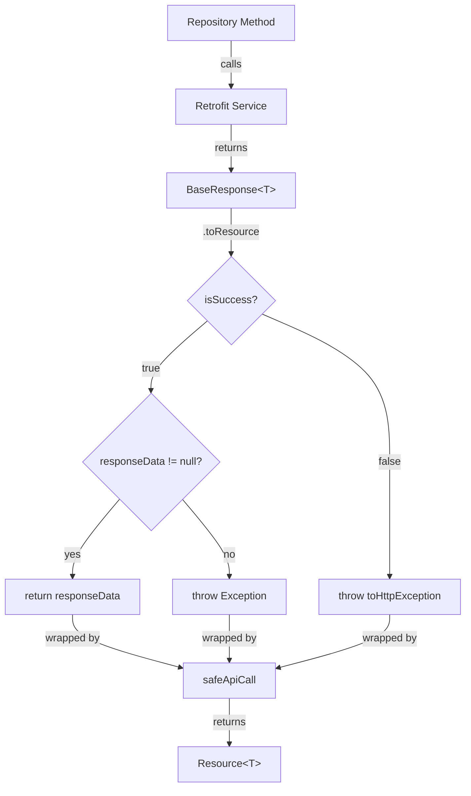
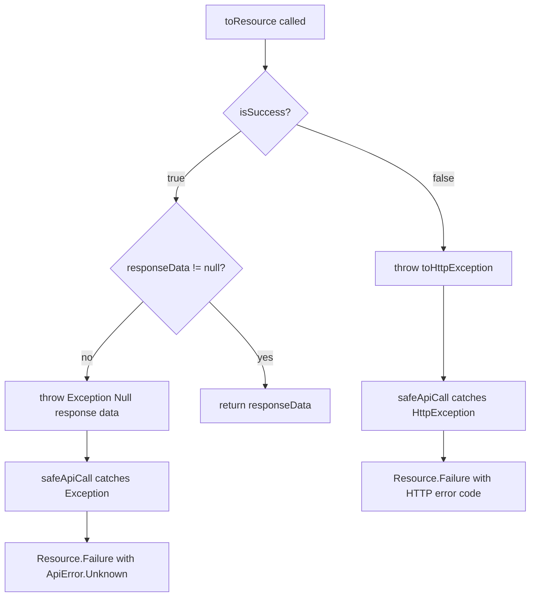

# Design Document: BaseResponse Extension Refactor

## Overview

This design introduces a reusable extension function `toResource()` on the `BaseResponse<T>` class to eliminate repetitive unwrapping logic across repository methods. Currently, the codebase contains duplicated if-else blocks in multiple repository methods (TransactionsRepository, BidsRepository, and others) that manually check `isSuccess`, unwrap `responseData`, and throw exceptions on failure.

The extension function will encapsulate this common pattern into a single, well-tested utility that:
- Returns the response data when the API call succeeds
- Throws appropriate exceptions when the API call fails or data is null
- Maintains type safety through Kotlin generics
- Reduces code duplication and improves maintainability

This refactoring is a pure code quality improvement with zero functional changes - all existing behavior will be preserved exactly.

## Architecture

### Current Pattern

The existing pattern appears in 5+ repository methods across the codebase:

```kotlin
suspend fun fetchRecommTransactions(...): Resource<TransactionsResponse> = safeApiCall {
  val response = recommendationService.recommendationTransactions(...)
  if (response.isSuccess) {
    response.responseData ?: throw Exception("Null response data")
  } else {
    throw response.toHttpException()
  }
}
```

This 5-line block is repeated with identical logic in:
- `TransactionsRepository.fetchRecommTransactions()`
- `TransactionsRepository.fetchIntracityRecommTransactions()`
- `TransactionsRepository.fetchSpotMarketplaceTransactions()`
- `BidsRepository` methods (2+ instances)
- Potentially other repositories

### Proposed Pattern

The new pattern will reduce this to a single line:

```kotlin
suspend fun fetchRecommTransactions(...): Resource<TransactionsResponse> = safeApiCall {
  recommendationService.recommendationTransactions(...).toResource()
}
```

### Architecture Diagram



## Components and Interfaces

### Extension Function

**Location:** `app/src/main/java/com/delhivery/axle/api/response/BaseResponse.kt`

**Signature:**
```kotlin
fun <T : Any> BaseResponse<T>.toResource(): T
```

**Implementation:**
```kotlin
/**
 * Unwraps a BaseResponse into its data payload or throws an appropriate exception.
 * 
 * This extension function encapsulates the common pattern of checking response success,
 * validating data presence, and throwing exceptions on failure. It should be used within
 * safeApiCall blocks in repository methods to handle BaseResponse unwrapping consistently.
 *
 * @return The response data of type T when the API call succeeds and data is present
 * @throws Exception with message "Null response data" when isSuccess is true but responseData is null
 * @throws HttpException when isSuccess is false (via toHttpException())
 */
fun <T : Any> BaseResponse<T>.toResource(): T {
  return if (isSuccess) {
    responseData ?: throw Exception("Null response data")
  } else {
    throw toHttpException()
  }
}
```

### Integration Points

**BaseRepository.safeApiCall():**
- The extension function is designed to be used within `safeApiCall` blocks
- `safeApiCall` catches all exceptions (including those thrown by `toResource()`) and maps them to `Resource.Failure`
- This maintains the existing error handling architecture

**Repository Methods:**
- All repository methods that currently use the if-else unwrapping pattern can be refactored
- The refactoring is backward compatible - method signatures remain unchanged
- Only the internal implementation changes

## Data Models

### Existing Models (No Changes)

**BaseResponse<T>:**
```kotlin
data class BaseResponse<M : Any>(
  @SerializedName("data") val responseData: M?,
  @SerializedName("success") val isSuccess: Boolean,
  @SerializedName("error") val errorBody: BaseErrorResponse?
)
```

**Resource<T>:**
```kotlin
sealed class Resource<out T> {
  object Loading : Resource<Nothing>()
  data class Success<out T>(val data: T?) : Resource<T>()
  data class Failure(
    val isNetworkError: Boolean,
    val errorCode: Int?,
    val apiError: ApiError
  ) : Resource<Nothing>()
}
```

### Data Flow

1. **API Call:** Repository calls Retrofit service method
2. **Response:** Service returns `BaseResponse<T>`
3. **Unwrap:** `toResource()` extracts data or throws exception
4. **Wrap:** `safeApiCall` catches exceptions and returns `Resource<T>`
5. **Observe:** ViewModel observes `Resource<T>` and updates UI

## Correctness Properties

*A property is a characteristic or behavior that should hold true across all valid executions of a system-essentially, a formal statement about what the system should do. Properties serve as the bridge between human-readable specifications and machine-verifiable correctness guarantees.*

### Property 1: Success Response Unwrapping

*For any* `BaseResponse<T>` instance where `isSuccess` is true and `responseData` is not null, calling `toResource()` should return the `responseData` value without throwing any exception.

**Validates: Requirements 1.3**

### Property 2: Failure Response Exception

*For any* `BaseResponse<T>` instance where `isSuccess` is false, calling `toResource()` should throw an `HttpException` that is equivalent to the result of calling `toHttpException()` on that response.

**Validates: Requirements 1.5**

### Property 3: Refactoring Behavioral Equivalence

*For any* valid input parameters to `fetchRecommTransactions`, the refactored implementation using `toResource()` should produce identical `Resource<TransactionsResponse>` results (Success with same data, or Failure with same error) as the original if-else implementation.

**Validates: Requirements 2.3, 3.3, 3.5**

## Error Handling

### Exception Scenarios

The `toResource()` extension function throws exceptions in two scenarios:

1. **Null Data Exception:**
   - **Condition:** `isSuccess == true && responseData == null`
   - **Exception:** `Exception("Null response data")`
   - **Handling:** Caught by `safeApiCall`, mapped to `Resource.Failure` with `ApiError.Unknown`

2. **HTTP Error Exception:**
   - **Condition:** `isSuccess == false`
   - **Exception:** `HttpException` (via `toHttpException()`)
   - **Handling:** Caught by `safeApiCall`, mapped to `Resource.Failure` with appropriate `ApiError` based on HTTP status code

### Error Flow Diagram



### Backward Compatibility

- All exception types remain unchanged
- Error messages remain identical
- `Resource.Failure` states are identical to original implementation
- No changes to error handling in ViewModels or UI layer

## Testing Strategy

### Dual Testing Approach

This refactoring requires both unit tests and property-based tests to ensure correctness:

**Unit Tests:**
- Specific examples of success responses with valid data
- Specific examples of failure responses with error bodies
- Edge case: success response with null data
- Integration test: verify refactored `fetchRecommTransactions` works end-to-end

**Property-Based Tests:**
- Universal properties across all possible `BaseResponse<T>` instances
- Randomized testing with 100+ iterations per property
- Validates behavior holds for all input combinations

### Property-Based Testing Configuration

**Framework:** Kotest Property Testing (recommended for Kotlin)
- Add dependency: `io.kotest:kotest-property:5.8.0`
- Minimum 100 iterations per property test
- Each test tagged with feature name and property reference

**Alternative:** If Kotest is not preferred, use:
- **kotlinx-test** for basic property testing
- **junit-quickcheck** for JUnit integration

### Test Implementation Plan

#### Unit Tests

**File:** `app/src/test/java/com/delhivery/axle/api/response/BaseResponseExtensionsTest.kt`

```kotlin
class BaseResponseExtensionsTest {
  
  @Test
  fun `toResource returns data when success is true and data is not null`() {
    val response = BaseResponse(
      responseData = TransactionsResponse(/* ... */),
      isSuccess = true,
      errorBody = null
    )
    val result = response.toResource()
    assertNotNull(result)
  }
  
  @Test
  fun `toResource throws Exception when success is true but data is null`() {
    val response = BaseResponse<TransactionsResponse>(
      responseData = null,
      isSuccess = true,
      errorBody = null
    )
    val exception = assertThrows<Exception> {
      response.toResource()
    }
    assertEquals("Null response data", exception.message)
  }
  
  @Test
  fun `toResource throws HttpException when success is false`() {
    val response = BaseResponse<TransactionsResponse>(
      responseData = null,
      isSuccess = false,
      errorBody = BaseErrorResponse("Error", 400, null)
    )
    assertThrows<HttpException> {
      response.toResource()
    }
  }
}
```

#### Property-Based Tests

**File:** `app/src/test/java/com/delhivery/axle/api/response/BaseResponsePropertiesTest.kt`

```kotlin
class BaseResponsePropertiesTest : StringSpec({
  
  "Property 1: Success responses with non-null data return that data" {
    // Feature: base-response-extension-refactor, Property 1: Success Response Unwrapping
    checkAll(100, Arb.successResponseWithData<String>()) { response ->
      val result = response.toResource()
      result shouldBe response.responseData
    }
  }
  
  "Property 2: Failure responses throw HttpException" {
    // Feature: base-response-extension-refactor, Property 2: Failure Response Exception
    checkAll(100, Arb.failureResponse<String>()) { response ->
      shouldThrow<HttpException> {
        response.toResource()
      }
    }
  }
  
  "Property 3: Refactored method produces identical results" {
    // Feature: base-response-extension-refactor, Property 3: Refactoring Behavioral Equivalence
    // This would require mocking the service and comparing old vs new implementation
    // Implementation details depend on testing infrastructure
  }
})

// Custom Arbitraries for generating test data
fun <T : Any> Arb.Companion.successResponseWithData(): Arb<BaseResponse<T>> = arbitrary {
  BaseResponse(
    responseData = /* generate random T */,
    isSuccess = true,
    errorBody = null
  )
}

fun <T : Any> Arb.Companion.failureResponse(): Arb<BaseResponse<T>> = arbitrary {
  BaseResponse(
    responseData = null,
    isSuccess = false,
    errorBody = BaseErrorResponse(
      errorMessage = Arb.string().bind(),
      _errorCode = Arb.int(400..599).bind(),
      data = null
    )
  )
}
```

### Test Coverage Goals

- **Unit Tests:** 100% coverage of `toResource()` function (all branches)
- **Property Tests:** 100+ iterations per property
- **Integration Tests:** Verify at least one refactored repository method works correctly
- **Regression Tests:** Ensure no existing tests break after refactoring

### Testing Execution

```bash
# Run all tests
./gradlew test

# Run specific test class
./gradlew test --tests BaseResponseExtensionsTest

# Run with coverage
./gradlew testDevelopmentDebugUnitTest jacocoTestReport
```
