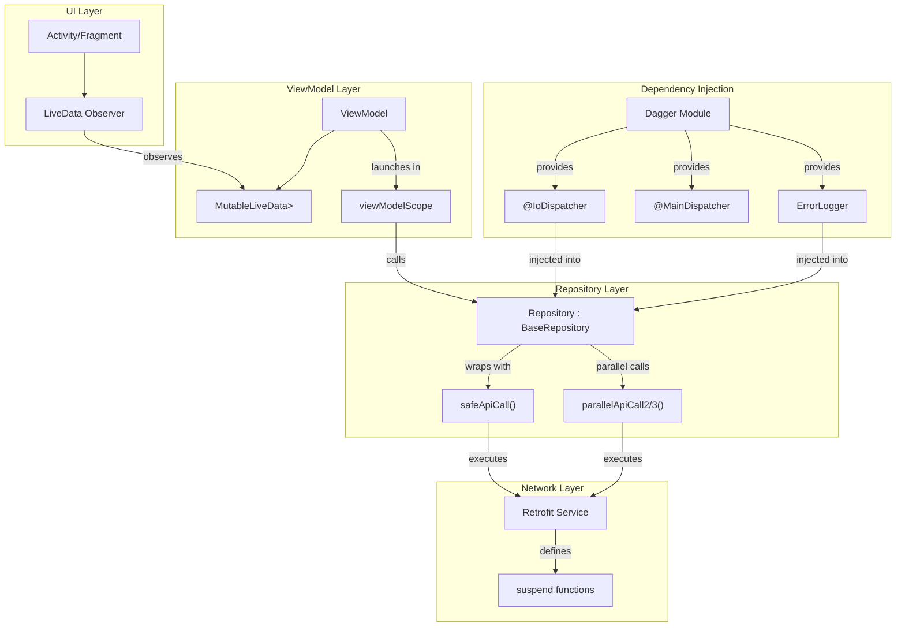
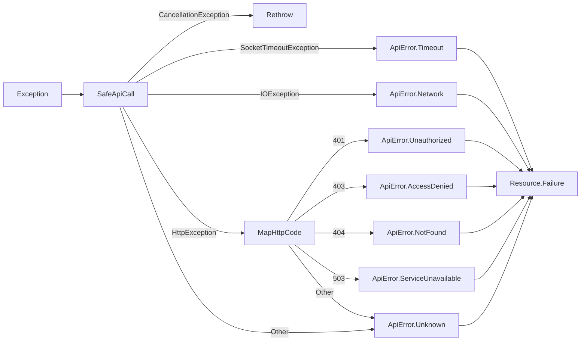

# Design Document: Coroutines API State Management

## Overview

This design introduces a standardized coroutine-based API state management pattern for the Axle Android application. The implementation replaces the existing RxJava-based asynchronous operations with Kotlin Coroutines, providing a cleaner, more readable approach to handling Loading, Success, and Error states.

The core components include:
- **Resource sealed class**: Type-safe representation of API call results (Success/Failure)
- **ApiError enum**: Categorized error types for consistent error handling
- **BaseRepository**: Abstract class with `safeApiCall` wrapper and parallel execution utilities
- **ErrorLogger interface**: Injectable error logging abstraction
- **ViewModel integration**: LiveData exposure with viewModelScope coroutine launching
- **Dagger modules**: Injectable coroutine dispatchers for testability

This approach maintains backward compatibility with existing RxJava-based code during migration while providing a modern, structured pattern for new API integrations.

## Architecture



### Data Flow

1. **UI initiates action** → Activity/Fragment calls ViewModel method
2. **ViewModel launches coroutine** → Uses `viewModelScope.launch` with injected dispatcher
3. **Repository executes API call** → Wraps call in `safeApiCall` or `parallelApiCall2/3`
4. **BaseRepository handles errors** → Maps exceptions to `ApiError` enum, logs via `ErrorLogger`
5. **Resource returned** → `Resource.Success` or `Resource.Failure` propagated up
6. **LiveData updated** → ViewModel posts result to `MutableLiveData`
7. **UI observes and renders** → Activity/Fragment handles all states via `when` expression

### Error Handling Flow



## Components and Interfaces

### 1. Resource Sealed Class

Location: `com.delhivery.axle.api.repository.Resource`

```kotlin
sealed class Resource<out T> {
    data class Success<out T>(val data: T?) : Resource<T>()
    data class Failure(
        val isNetworkError: Boolean,
        val errorCode: Int?,
        val apiError: ApiError
    ) : Resource<Nothing>()
}
```

### 2. ApiError Enum

Location: `com.delhivery.axle.api.repository.ApiError`

```kotlin
enum class ApiError {
    Timeout,
    Network,
    Unauthorized,
    AccessDenied,
    NotFound,
    ServiceUnavailable,
    Unknown
}
```

### 3. ErrorLogger Interface

Location: `com.delhivery.axle.utils.ErrorLogger`

```kotlin
interface ErrorLogger {
    fun log(exception: Exception)
}
```

### 4. BaseRepository Abstract Class

Location: `com.delhivery.axle.api.repository.BaseRepository`

```kotlin
abstract class BaseRepository(
    private val errorLogger: ErrorLogger
) {
    suspend fun <T> safeApiCall(apiCall: suspend () -> T): Resource<T>
    
    suspend fun <T1, T2, R> parallelApiCall2(
        call1: suspend () -> T1,
        call2: suspend () -> T2,
        transform: (T1, T2) -> R
    ): Resource<R>
    
    suspend fun <T1, T2, T3, R> parallelApiCall3(
        call1: suspend () -> T1,
        call2: suspend () -> T2,
        call3: suspend () -> T3,
        transform: (T1, T2, T3) -> R
    ): Resource<R>
}
```

### 5. Dispatcher Qualifiers

Location: `com.delhivery.axle.injection.qualifier`

```kotlin
@Qualifier
@Retention(AnnotationRetention.BINARY)
annotation class IoDispatcher

@Qualifier
@Retention(AnnotationRetention.BINARY)
annotation class MainDispatcher
```

### 6. CoroutineModule

Location: `com.delhivery.axle.injection.module.CoroutineModule`

```kotlin
@Module
class CoroutineModule {
    @Provides
    @Singleton
    @IoDispatcher
    fun provideIoDispatcher(): CoroutineDispatcher = Dispatchers.IO
    
    @Provides
    @Singleton
    @MainDispatcher
    fun provideMainDispatcher(): CoroutineDispatcher = Dispatchers.Main
    
    @Provides
    @Singleton
    fun provideErrorLogger(): ErrorLogger = CrashlyticsErrorLogger()
}
```

### 7. Retrofit Service with Suspend Functions

Example pattern for new endpoints:

```kotlin
interface ExampleService {
    @GET("endpoint")
    suspend fun getData(): Response<DataResponse>
    
    @POST("endpoint")
    suspend fun postData(@Body request: DataRequest): DataResponse
}
```

### 8. Repository Implementation Pattern

```kotlin
@Singleton
class ExampleRepository @Inject constructor(
    private val service: ExampleService,
    errorLogger: ErrorLogger,
    @IoDispatcher private val ioDispatcher: CoroutineDispatcher
) : BaseRepository(errorLogger) {
    
    suspend fun fetchData(): Resource<DataResponse> = withContext(ioDispatcher) {
        safeApiCall { service.getData().body()!! }
    }
    
    suspend fun fetchCombinedData(): Resource<CombinedData> = withContext(ioDispatcher) {
        parallelApiCall2(
            call1 = { service.getUser() },
            call2 = { service.getWallet() }
        ) { user, wallet ->
            CombinedData(user = user, wallet = wallet)
        }
    }
}
```

### 9. ViewModel Pattern

```kotlin
class ExampleViewModel @Inject constructor(
    private val repository: ExampleRepository
) : BaseViewModel() {
    
    private val _dataState = MutableLiveData<Resource<DataResponse>>()
    val dataState: LiveData<Resource<DataResponse>> = _dataState
    
    private val _isLoading = MutableLiveData<Boolean>()
    val isLoading: LiveData<Boolean> = _isLoading
    
    fun fetchData() {
        viewModelScope.launch {
            _isLoading.value = true
            _dataState.value = repository.fetchData()
            _isLoading.value = false
        }
    }
}
```

### 10. UI Observation Pattern

```kotlin
// In Activity/Fragment
viewModel.dataState.observe(viewLifecycleOwner) { resource ->
    when (resource) {
        is Resource.Success -> {
            hideLoading()
            displayData(resource.data)
        }
        is Resource.Failure -> {
            hideLoading()
            handleError(resource.apiError)
        }
    }
}

private fun handleError(apiError: ApiError) {
    val message = when (apiError) {
        ApiError.Timeout -> getString(R.string.error_timeout)
        ApiError.Network -> getString(R.string.error_network)
        ApiError.Unauthorized -> {
            navigateToLogin()
            getString(R.string.error_unauthorized)
        }
        ApiError.AccessDenied -> getString(R.string.error_access_denied)
        ApiError.NotFound -> getString(R.string.error_not_found)
        ApiError.ServiceUnavailable -> getString(R.string.error_service_unavailable)
        ApiError.Unknown -> getString(R.string.error_unknown)
    }
    showErrorDialog(message)
}
```

## Data Models

### Resource Sealed Class

```kotlin
/**
 * Represents the result of an API operation.
 * @param T The type of data on success
 */
sealed class Resource<out T> {
    /**
     * Successful API response
     * @param data The response data (nullable for empty body responses)
     */
    data class Success<out T>(val data: T?) : Resource<T>()
    
    /**
     * Failed API response
     * @param isNetworkError True if failure was due to network connectivity
     * @param errorCode HTTP status code if available
     * @param apiError Categorized error type
     */
    data class Failure(
        val isNetworkError: Boolean,
        val errorCode: Int?,
        val apiError: ApiError
    ) : Resource<Nothing>()
}
```

### ApiError Enum

```kotlin
/**
 * Categorized API error types for consistent error handling
 */
enum class ApiError {
    /** SocketTimeoutException - request timed out */
    Timeout,
    /** IOException - network connectivity issues */
    Network,
    /** HTTP 401 - authentication required */
    Unauthorized,
    /** HTTP 403 - insufficient permissions */
    AccessDenied,
    /** HTTP 404 - resource not found */
    NotFound,
    /** HTTP 503 - service temporarily unavailable */
    ServiceUnavailable,
    /** All other unhandled errors */
    Unknown
}
```

### ErrorLogger Interface

```kotlin
/**
 * Interface for logging errors, injectable for flexibility
 */
interface ErrorLogger {
    /**
     * Log an exception
     * @param exception The exception to log
     */
    fun log(exception: Exception)
}
```

### CrashlyticsErrorLogger Implementation

```kotlin
/**
 * Production implementation that logs to Firebase Crashlytics
 */
class CrashlyticsErrorLogger : ErrorLogger {
    override fun log(exception: Exception) {
        FirebaseCrashlytics.getInstance().recordException(exception)
    }
}
```

### Dispatcher Qualifier Annotations

```kotlin
/**
 * Qualifier for IO dispatcher injection
 */
@Qualifier
@Retention(AnnotationRetention.BINARY)
annotation class IoDispatcher

/**
 * Qualifier for Main dispatcher injection
 */
@Qualifier
@Retention(AnnotationRetention.BINARY)
annotation class MainDispatcher
```


## Correctness Properties

*A property is a characteristic or behavior that should hold true across all valid executions of a system—essentially, a formal statement about what the system should do. Properties serve as the bridge between human-readable specifications and machine-verifiable correctness guarantees.*

### Property 1: Resource Sealed Class Structure Invariants

*For any* instance of Resource, it must be either a Success or Failure subclass. *For any* Success instance with generic type T, the data field must be of type T or null. *For any* Failure instance, it must contain isNetworkError (Boolean), errorCode (Int?), and apiError (ApiError) fields.

**Validates: Requirements 1.1, 1.2, 1.3, 1.5**

### Property 2: safeApiCall Exception-to-ApiError Mapping

*For any* suspend lambda passed to safeApiCall:
- If the lambda completes successfully, safeApiCall returns Resource.Success containing the result
- If the lambda throws SocketTimeoutException, safeApiCall returns Resource.Failure with ApiError.Timeout
- If the lambda throws IOException (non-timeout), safeApiCall returns Resource.Failure with isNetworkError=true and ApiError.Network
- If the lambda throws HttpException, safeApiCall returns Resource.Failure with ApiError mapped from HTTP status code (401→Unauthorized, 403→AccessDenied, 404→NotFound, 503→ServiceUnavailable, other→Unknown)
- If the lambda throws any other Exception, safeApiCall returns Resource.Failure with ApiError.Unknown
- If the lambda throws CancellationException, safeApiCall rethrows it

**Validates: Requirements 3.3, 3.4, 3.5, 3.6, 3.7, 3.8, 2.8**

### Property 3: HTTP Status Code to ApiError Mapping

*For any* HTTP status code received in an HttpException:
- 401 maps to ApiError.Unauthorized
- 403 maps to ApiError.AccessDenied
- 404 maps to ApiError.NotFound
- 503 maps to ApiError.ServiceUnavailable
- All other codes map to ApiError.Unknown

**Validates: Requirements 2.4, 2.5, 2.6, 2.7, 2.8**

### Property 4: parallelApiCall2 Correctness

*For any* two suspend lambdas and transform function passed to parallelApiCall2:
- Both lambdas execute concurrently (neither blocks the other from starting)
- If both lambdas succeed, parallelApiCall2 returns Resource.Success with the transform applied to both results
- If either lambda throws an exception, parallelApiCall2 returns Resource.Failure with the appropriate ApiError

**Validates: Requirements 10.2, 10.3, 10.4, 10.5**

### Property 5: parallelApiCall3 Correctness

*For any* three suspend lambdas and transform function passed to parallelApiCall3:
- All three lambdas execute concurrently (none blocks others from starting)
- If all lambdas succeed, parallelApiCall3 returns Resource.Success with the transform applied to all three results
- If any lambda throws an exception, parallelApiCall3 returns Resource.Failure with the appropriate ApiError

**Validates: Requirements 10.7, 10.8, 10.9, 10.10**

### Property 6: ViewModel State Lifecycle

*For any* API call initiated through a ViewModel:
- Loading state is emitted before the API call begins
- When the API call completes (success or failure), the Resource result is emitted to LiveData
- Loading state is set to false after the Resource is emitted

**Validates: Requirements 6.4, 6.5, 10.13**

### Property 7: Transform Function Application

*For any* successful parallelApiCall2 with results (r1, r2) and transform function f, the returned Resource.Success.data equals f(r1, r2). *For any* successful parallelApiCall3 with results (r1, r2, r3) and transform function f, the returned Resource.Success.data equals f(r1, r2, r3).

**Validates: Requirements 10.3, 10.8**

## Error Handling

### Exception Handling Strategy

The `safeApiCall` function in BaseRepository implements a comprehensive exception handling strategy:

```kotlin
suspend fun <T> safeApiCall(apiCall: suspend () -> T): Resource<T> {
    return try {
        Resource.Success(apiCall())
    } catch (e: CancellationException) {
        // Respect coroutine cancellation - rethrow
        throw e
    } catch (e: SocketTimeoutException) {
        errorLogger.log(e)
        Resource.Failure(
            isNetworkError = true,
            errorCode = null,
            apiError = ApiError.Timeout
        )
    } catch (e: IOException) {
        errorLogger.log(e)
        Resource.Failure(
            isNetworkError = true,
            errorCode = null,
            apiError = ApiError.Network
        )
    } catch (e: HttpException) {
        errorLogger.log(e)
        Resource.Failure(
            isNetworkError = false,
            errorCode = e.code(),
            apiError = mapHttpCodeToApiError(e.code())
        )
    } catch (e: Exception) {
        errorLogger.log(e)
        Resource.Failure(
            isNetworkError = false,
            errorCode = null,
            apiError = ApiError.Unknown
        )
    }
}

private fun mapHttpCodeToApiError(code: Int): ApiError = when (code) {
    401 -> ApiError.Unauthorized
    403 -> ApiError.AccessDenied
    404 -> ApiError.NotFound
    503 -> ApiError.ServiceUnavailable
    else -> ApiError.Unknown
}
```

### Parallel Call Error Handling

For `parallelApiCall2` and `parallelApiCall3`, if any call fails:
1. The `coroutineScope` ensures all child coroutines are cancelled
2. The first exception is caught and mapped to Resource.Failure
3. Other concurrent calls are cancelled via structured concurrency

```kotlin
suspend fun <T1, T2, R> parallelApiCall2(
    call1: suspend () -> T1,
    call2: suspend () -> T2,
    transform: (T1, T2) -> R
): Resource<R> {
    return try {
        coroutineScope {
            val deferred1 = async { call1() }
            val deferred2 = async { call2() }
            Resource.Success(transform(deferred1.await(), deferred2.await()))
        }
    } catch (e: CancellationException) {
        throw e
    } catch (e: Exception) {
        // Map exception using same logic as safeApiCall
        mapExceptionToFailure(e)
    }
}
```

### UI Error Handling

Activities/Fragments handle errors exhaustively using Kotlin's `when` expression:

```kotlin
when (resource.apiError) {
    ApiError.Timeout -> showRetryDialog(R.string.error_timeout)
    ApiError.Network -> showNetworkErrorWithRetry()
    ApiError.Unauthorized -> {
        // Clear credentials and navigate to login
        authRepository.logout()
        navigationUtils.navigateToLogin()
    }
    ApiError.AccessDenied -> showErrorDialog(R.string.error_access_denied)
    ApiError.NotFound -> showErrorDialog(R.string.error_not_found)
    ApiError.ServiceUnavailable -> showRetryDialog(R.string.error_service_unavailable)
    ApiError.Unknown -> showErrorDialog(R.string.error_unknown)
}
```

### Error Logging

All exceptions are logged via the `ErrorLogger` interface before being converted to `Resource.Failure`. The production implementation logs to Firebase Crashlytics for monitoring and debugging.

## Testing Strategy

### Dual Testing Approach

This feature requires both unit tests and property-based tests for comprehensive coverage:

- **Unit tests**: Verify specific examples, edge cases, and integration points
- **Property tests**: Verify universal properties across all valid inputs using randomized testing

### Property-Based Testing Configuration

- **Library**: [Kotest](https://kotest.io/) with property testing module (`io.kotest:kotest-property`)
- **Minimum iterations**: 100 per property test
- **Tag format**: `Feature: coroutines-api-state-management, Property {number}: {property_text}`

### Unit Test Coverage

| Component | Test Focus |
|-----------|------------|
| Resource | Sealed class structure, Success/Failure instantiation |
| ApiError | Enum values exist, HTTP code mapping examples |
| BaseRepository.safeApiCall | Each exception type mapping (SocketTimeout, IOException, HttpException, etc.) |
| BaseRepository.parallelApiCall2 | Two successful calls, first call fails, second call fails |
| BaseRepository.parallelApiCall3 | Three successful calls, any call fails |
| ViewModel | Loading state emission, Resource emission, state updates |
| CoroutineModule | Dispatcher provision, ErrorLogger provision |

### Property Test Coverage

| Property | Test Description |
|----------|------------------|
| Property 1 | Generate random Resource instances, verify structure invariants |
| Property 2 | Generate random exceptions, verify correct ApiError mapping |
| Property 3 | Generate random HTTP status codes, verify correct ApiError |
| Property 4 | Generate random call results/exceptions for parallelApiCall2 |
| Property 5 | Generate random call results/exceptions for parallelApiCall3 |
| Property 6 | Generate random API call sequences, verify state lifecycle |
| Property 7 | Generate random transform functions and inputs, verify application |

### Test Implementation Example

```kotlin
class SafeApiCallPropertyTest : FunSpec({
    // Feature: coroutines-api-state-management, Property 2: safeApiCall Exception-to-ApiError Mapping
    test("safeApiCall maps all exception types to correct ApiError").config(
        invocations = 100
    ) {
        checkAll(Arb.exceptionArb()) { exception ->
            val repository = TestRepository(TestErrorLogger())
            val result = repository.testSafeApiCall { throw exception }
            
            when (exception) {
                is CancellationException -> { /* should rethrow */ }
                is SocketTimeoutException -> {
                    result.shouldBeInstanceOf<Resource.Failure>()
                    (result as Resource.Failure).apiError shouldBe ApiError.Timeout
                }
                is IOException -> {
                    result.shouldBeInstanceOf<Resource.Failure>()
                    (result as Resource.Failure).apiError shouldBe ApiError.Network
                    result.isNetworkError shouldBe true
                }
                is HttpException -> {
                    result.shouldBeInstanceOf<Resource.Failure>()
                    val expected = mapHttpCodeToApiError(exception.code())
                    (result as Resource.Failure).apiError shouldBe expected
                }
                else -> {
                    result.shouldBeInstanceOf<Resource.Failure>()
                    (result as Resource.Failure).apiError shouldBe ApiError.Unknown
                }
            }
        }
    }
})
```

### Test Dependencies

Add to `app/build.gradle`:

```groovy
testImplementation "io.kotest:kotest-runner-junit5:5.5.5"
testImplementation "io.kotest:kotest-assertions-core:5.5.5"
testImplementation "io.kotest:kotest-property:5.5.5"
testImplementation "org.jetbrains.kotlinx:kotlinx-coroutines-test:1.6.4"
testImplementation "io.mockk:mockk:1.13.4"
```

### Mocking Strategy

- Use `MockK` for mocking Retrofit services and ErrorLogger
- Use `kotlinx-coroutines-test` with `TestDispatcher` for coroutine testing
- Inject `TestDispatcher` via Dagger for ViewModel tests
- Use `InstantTaskExecutorRule` for LiveData testing
