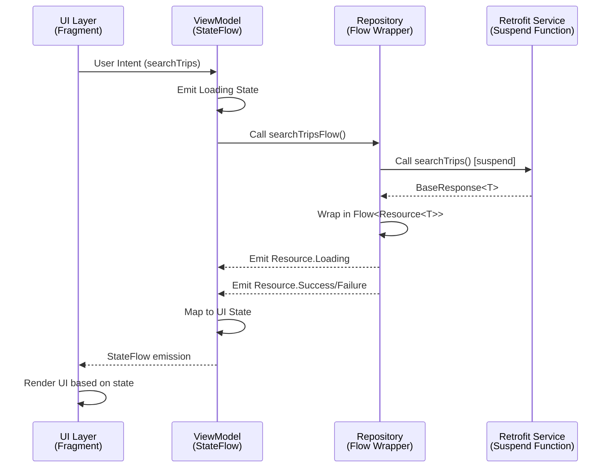
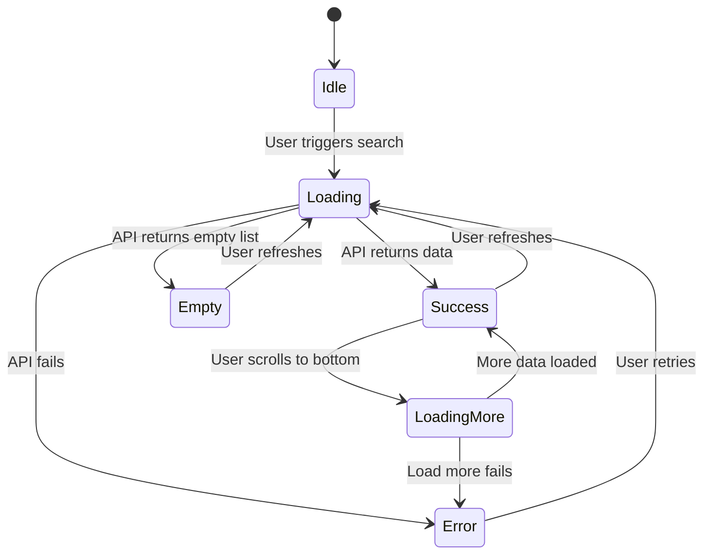

# Design Document: Flow-based API State Management

## Overview

This design document specifies the architecture for migrating the Axle Android application from RxJava-based API state management to a modern Kotlin Flow-based architecture using the MVI (Model-View-Intent) pattern. The solution provides type-safe UI state modeling, lifecycle-aware state collection, and robust error handling while maintaining testability and scalability.

### Goals

- Replace RxJava Single with Kotlin suspend functions and Flow for reactive API calls
- Implement MVI pattern with StateFlow for predictable state management
- Provide lifecycle-aware state collection to prevent memory leaks
- Enable reusable patterns across all API endpoints
- Support pagination and pull-to-refresh scenarios
- Handle one-time events (navigation, toasts) correctly

### Non-Goals

- Complete migration of all endpoints (only searchTrips as reference)
- Changes to the BaseRepository error handling logic (reuse existing patterns)
- Modifications to other parts of the app still using RxJava

## Architecture

### High-Level Architecture

The architecture follows the MVI pattern with unidirectional data flow:

```
┌─────────────────────────────────────────────────────────────┐
│                         UI Layer                             │
│  (Fragment/Activity - Observes State, Emits Intents)       │
└────────────────┬────────────────────────────────────────────┘
                 │ Intents (User Actions)
                 ▼
┌─────────────────────────────────────────────────────────────┐
│                      ViewModel Layer                         │
│     (Processes Intents, Manages State with StateFlow)       │
└────────────────┬────────────────────────────────────────────┘
                 │ Repository Calls
                 ▼
┌─────────────────────────────────────────────────────────────┐
│                    Repository Layer                          │
│    (Wraps suspend calls in Flow, Emits Resource States)     │
└────────────────┬────────────────────────────────────────────┘
                 │ Suspend Function Calls
                 ▼
┌─────────────────────────────────────────────────────────────┐
│                      Service Layer                           │
│         (Retrofit Interfaces - Returns suspend functions)   │
└─────────────────────────────────────────────────────────────┘
```

### Data Flow Diagram



### State Transition Diagram



## Components and Interfaces

### 1. UI State Model

The UI state is modeled as a sealed class hierarchy that represents all possible states:

```kotlin
/**
 * Sealed class representing all possible UI states for API-driven screens.
 * This provides type-safe exhaustive handling of all states in the UI layer.
 *
 * @param T The type of data being displayed
 */
sealed class UiState<out T> {
    
    /**
     * Initial state before any data is loaded.
     */
    object Idle : UiState<Nothing>()
    
    /**
     * Loading state indicating an API operation is in progress.
     * 
     * @param isRefreshing True if this is a pull-to-refresh operation
     */
    data class Loading(val isRefreshing: Boolean = false) : UiState<Nothing>()
    
    /**
     * Successful state with data.
     * 
     * @param data The loaded data
     * @param isLoadingMore True if loading additional paginated data
     * @param hasMore True if more data is available for pagination
     */
    data class Success<T>(
        val data: T,
        val isLoadingMore: Boolean = false,
        val hasMore: Boolean = false
    ) : UiState<T>()
    
    /**
     * Empty state when API returns successfully but with no data.
     * 
     * @param message Optional message to display
     */
    data class Empty(val message: String = "No data available") : UiState<Nothing>()
    
    /**
     * Error state when API call fails.
     * 
     * @param apiError The categorized error type
     * @param message User-friendly error message
     * @param isNetworkError True if the error is network-related
     */
    data class Error(
        val apiError: ApiError,
        val message: String,
        val isNetworkError: Boolean
    ) : UiState<Nothing>()
}
```

### 2. Retrofit Service Layer

Retrofit service updated to return suspend functions directly:

```kotlin
interface LoadCycleService {
    
    /**
     * Search trips endpoint using suspend function.
     * Retrofit automatically handles coroutine execution on background thread.
     *
     * @param request JsonObject containing search parameters (origin, destination, etc.)
     * @return BaseResponse<SearchTripsResponse> wrapped in suspend function
     */
    @POST("/trips")
    suspend fun searchTrips(@Body request: JsonObject): BaseResponse<SearchTripsResponse>
    
    /**
     * Get frequent lanes endpoint using suspend function.
     *
     * @param request JsonObject containing request parameters
     * @return BaseResponse<FrequentTripsResponse> wrapped in suspend function
     */
    @POST("/frequent-lanes")
    suspend fun getFrequentLanes(@Body request: JsonObject): BaseResponse<FrequentTripsResponse>
}
```

### 3. Flow Conversion Utilities

Extension function to convert suspend API calls to Flow with Resource wrapper:

```kotlin
/**
 * Executes a suspend API call and wraps the result in Flow<Resource<T>>.
 * This utility provides consistent error handling and Loading state emission.
 *
 * Flow emission sequence:
 * 1. Resource.Loading - emitted immediately
 * 2. Resource.Success or Resource.Failure - emitted when API call completes
 *
 * Exception handling:
 * - All exceptions are caught and mapped to Resource.Failure
 * - Uses existing BaseRepository error mapping logic
 *
 * @param apiCall Suspend function that makes the API call
 * @return Flow that emits Loading, then Success or Failure
 */
fun <T : Any> safeApiCallFlow(apiCall: suspend () -> BaseResponse<T>): Flow<Resource<T>> = flow {
    emit(Resource.Loading)
    try {
        // Execute the suspend API call
        val response = apiCall()
        
        // Use existing toResource() extension to unwrap BaseResponse
        val data = response.toResource()
        emit(Resource.Success(data))
    } catch (e: CancellationException) {
        // Respect coroutine cancellation - rethrow to propagate
        throw e
    } catch (e: SocketTimeoutException) {
        emit(Resource.Failure(
            isNetworkError = true,
            errorCode = null,
            apiError = ApiError.Timeout
        ))
    } catch (e: IOException) {
        emit(Resource.Failure(
            isNetworkError = true,
            errorCode = null,
            apiError = ApiError.Network
        ))
    } catch (e: HttpException) {
        emit(Resource.Failure(
            isNetworkError = false,
            errorCode = e.code(),
            apiError = mapHttpCodeToApiError(e.code())
        ))
    } catch (e: Exception) {
        emit(Resource.Failure(
            isNetworkError = false,
            errorCode = null,
            apiError = ApiError.Unknown
        ))
    }
}.flowOn(Dispatchers.IO)

/**
 * Maps HTTP status codes to ApiError enum values.
 * Reuses the same mapping logic from BaseRepository.
 */
private fun mapHttpCodeToApiError(code: Int): ApiError = when (code) {
    401 -> ApiError.Unauthorized
    403 -> ApiError.AccessDenied
    404 -> ApiError.NotFound
    503 -> ApiError.ServiceUnavailable
    else -> ApiError.Unknown
}
```

### 4. Repository Layer Implementation

Updated LoadCycleRepository with Flow-based methods (RxJava removed):

```kotlin
@Singleton
class LoadCycleRepository @Inject constructor(
    private val loadsService: LoadCycleService,
    errorLogger: ErrorLogger
) : BaseRepository(errorLogger) {

    /**
     * Flow-based method for searchTrips API.
     * Wraps the suspend API call in Flow with Resource states.
     *
     * @param request JsonObject containing search parameters
     * @return Flow<Resource<SearchTripsResponse>> that emits Loading, then Success or Failure
     */
    fun searchTripsFlow(request: JsonObject): Flow<Resource<SearchTripsResponse>> {
        return safeApiCallFlow { loadsService.searchTrips(request) }
    }

    /**
     * Flow-based method for frequent lanes API.
     * Wraps the suspend API call in Flow with Resource states.
     *
     * @param request JsonObject containing request parameters
     * @return Flow<Resource<FrequentTripsResponse>> that emits Loading, then Success or Failure
     */
    fun getFrequentLanesFlow(request: JsonObject): Flow<Resource<FrequentTripsResponse>> {
        return safeApiCallFlow { loadsService.getFrequentLanes(request) }
    }
}
```

### 5. ViewModel State Management

ViewModel implementation using StateFlow and MVI pattern:

```kotlin
/**
 * ViewModel for search trips screen using Flow-based MVI architecture.
 * 
 * Key responsibilities:
 * - Process user intents (search, refresh, loadMore)
 * - Manage UI state using StateFlow
 * - Handle pagination state
 * - Emit one-time events for navigation and messages
 */
class SearchTripsViewModel @Inject constructor(
    private val repository: LoadCycleRepository
) : ViewModel() {

    // UI State - Single source of truth
    private val _uiState = MutableStateFlow<UiState<List<Trip>>>(UiState.Idle)
    val uiState: StateFlow<UiState<List<Trip>>> = _uiState.asStateFlow()

    // One-time events (navigation, toasts, snackbars)
    private val _events = MutableSharedFlow<UiEvent>(replay = 0)
    val events: SharedFlow<UiEvent> = _events.asSharedFlow()

    // Pagination state
    private var currentOffset = 0
    private var hasMore = true
    private val pageSize = UserSearchLimit

    // Current search parameters (for pagination and retry)
    private var currentSearchRequest: JsonObject? = null

    /**
     * Intent: User initiates a new search
     */
    fun searchTrips(request: JsonObject) {
        currentSearchRequest = request
        currentOffset = 0
        hasMore = true
        
        viewModelScope.launch {
            repository.searchTripsFlow(buildRequest(request, 0))
                .collect { resource ->
                    _uiState.value = mapResourceToUiState(resource, isInitialLoad = true)
                }
        }
    }

    /**
     * Intent: User pulls to refresh
     */
    fun refresh() {
        val request = currentSearchRequest ?: return
        currentOffset = 0
        hasMore = true
        
        viewModelScope.launch {
            // Set refreshing flag
            _uiState.value = UiState.Loading(isRefreshing = true)
            
            repository.searchTripsFlow(buildRequest(request, 0))
                .collect { resource ->
                    when (resource) {
                        is Resource.Loading -> {
                            // Keep refreshing state
                        }
                        is Resource.Success -> {
                            val trips = resource.data?.trips ?: emptyList()
                            if (trips.isEmpty()) {
                                _uiState.value = UiState.Empty()
                            } else {
                                currentOffset = trips.size
                                hasMore = resource.data?.hasMore ?: false
                                _uiState.value = UiState.Success(
                                    data = trips,
                                    hasMore = hasMore
                                )
                            }
                        }
                        is Resource.Failure -> {
                            // Preserve existing data if available, show error in snackbar
                            val currentState = _uiState.value
                            if (currentState is UiState.Success) {
                                _events.emit(UiEvent.ShowSnackbar(
                                    message = getErrorMessage(resource.apiError),
                                    action = "Retry"
                                ))
                            } else {
                                _uiState.value = UiState.Error(
                                    apiError = resource.apiError,
                                    message = getErrorMessage(resource.apiError),
                                    isNetworkError = resource.isNetworkError
                                )
                            }
                        }
                    }
                }
        }
    }

    /**
     * Intent: User scrolls to bottom and triggers load more
     */
    fun loadMore() {
        if (!hasMore) return
        
        val request = currentSearchRequest ?: return
        val currentState = _uiState.value
        if (currentState !is UiState.Success) return
        
        viewModelScope.launch {
            // Set loading more flag
            _uiState.value = currentState.copy(isLoadingMore = true)
            
            repository.searchTripsFlow(buildRequest(request, currentOffset))
                .collect { resource ->
                    when (resource) {
                        is Resource.Loading -> {
                            // Keep loading more state
                        }
                        is Resource.Success -> {
                            val newTrips = resource.data?.trips ?: emptyList()
                            val allTrips = currentState.data + newTrips
                            currentOffset = allTrips.size
                            hasMore = resource.data?.hasMore ?: false
                            
                            _uiState.value = UiState.Success(
                                data = allTrips,
                                isLoadingMore = false,
                                hasMore = hasMore
                            )
                        }
                        is Resource.Failure -> {
                            // Preserve existing data, show error
                            _uiState.value = currentState.copy(isLoadingMore = false)
                            _events.emit(UiEvent.ShowSnackbar(
                                message = "Failed to load more: ${getErrorMessage(resource.apiError)}",
                                action = "Retry"
                            ))
                        }
                    }
                }
        }
    }

    /**
     * Intent: User taps retry button
     */
    fun retry() {
        val request = currentSearchRequest ?: return
        searchTrips(request)
    }

    /**
     * Maps Resource to UiState
     */
    private fun mapResourceToUiState(
        resource: Resource<SearchTripsResponse>,
        isInitialLoad: Boolean
    ): UiState<List<Trip>> {
        return when (resource) {
            is Resource.Loading -> UiState.Loading(isRefreshing = false)
            is Resource.Success -> {
                val trips = resource.data?.trips ?: emptyList()
                if (trips.isEmpty()) {
                    UiState.Empty()
                } else {
                    currentOffset = trips.size
                    hasMore = resource.data?.hasMore ?: false
                    UiState.Success(
                        data = trips,
                        hasMore = hasMore
                    )
                }
            }
            is Resource.Failure -> UiState.Error(
                apiError = resource.apiError,
                message = getErrorMessage(resource.apiError),
                isNetworkError = resource.isNetworkError
            )
        }
    }

    /**
     * Builds request with pagination parameters
     */
    private fun buildRequest(baseRequest: JsonObject, offset: Int): JsonObject {
        return baseRequest.deepCopy().apply {
            addProperty("offset", offset)
            addProperty("limit", pageSize)
        }
    }

    /**
     * Maps ApiError to user-friendly message
     */
    private fun getErrorMessage(apiError: ApiError): String {
        return when (apiError) {
            ApiError.Network -> "No internet connection. Please check your network."
            ApiError.Timeout -> "Request timed out. Please try again."
            ApiError.Unauthorized -> "Session expired. Please log in again."
            ApiError.AccessDenied -> "You don't have permission to access this resource."
            ApiError.NotFound -> "Resource not found."
            ApiError.ServiceUnavailable -> "Service temporarily unavailable. Please try again later."
            ApiError.Unknown -> "An unexpected error occurred. Please try again."
        }
    }
}

/**
 * Sealed class for one-time UI events
 */
sealed class UiEvent {
    data class ShowToast(val message: String) : UiEvent()
    data class ShowSnackbar(val message: String, val action: String? = null) : UiEvent()
    data class Navigate(val destination: String) : UiEvent()
}
```

## Data Models

### SearchTripsResponse

```kotlin
data class SearchTripsResponse(
    @SerializedName("trips") val trips: List<Trip>,
    @SerializedName("total") val total: Int,
    @SerializedName("offset") val offset: Int,
    @SerializedName("limit") val limit: Int,
    @SerializedName("has_more") val hasMore: Boolean
)

data class Trip(
    @SerializedName("transaction_id") val transactionId: String,
    @SerializedName("origin") val origin: String,
    @SerializedName("destination") val destination: String,
    @SerializedName("vehicle_type") val vehicleType: String,
    @SerializedName("price") val price: Double,
    // ... other fields
)
```

## Correctness Properties

*A property is a characteristic or behavior that should hold true across all valid executions of a system—essentially, a formal statement about what the system should do. Properties serve as the bridge between human-readable specifications and machine-verifiable correctness guarantees.*


### Property Reflection

After analyzing all acceptance criteria, I've identified the following testable properties and eliminated redundancy:

**Redundancy Analysis:**
- Properties 1.2 and 3.4 both test successful emission - can be combined into one comprehensive property
- Properties 1.3 and 3.5 both test error emission - can be combined into one comprehensive property
- Properties 3.3 (Loading first) is subsumed by the general emission order property
- Properties 9.3, 9.4, 9.5, 9.7 can be combined into comprehensive pagination properties
- Properties 10.2, 10.3, 10.4, 10.5, 10.7 can be combined into comprehensive refresh properties
- Properties 5.2 and 5.3 can be combined into one lifecycle property

**Final Property Set:**
1. Flow conversion preserves data (round-trip)
2. Flow emits Loading before Success/Failure
3. Error information is preserved during conversion
4. Cancellation propagates correctly
5. Resource to UiState mapping is correct
6. State transitions follow correct sequences
7. Pagination appends data correctly
8. Pagination preserves data on failure
9. Refresh replaces data correctly
10. Refresh preserves data on failure
11. One-time events are consumed once
12. One-time events don't replay after config changes
13. Lifecycle collection starts and stops correctly
14. State is preserved across configuration changes
15. Retry triggers the same request
16. New intents clear error state
17. No memory leaks after destruction

### Property 1: Suspend API Call Data Preservation

*For any* successful suspend API call that returns BaseResponse<T>, wrapping it in Flow and collecting the Success emission should yield the same data as the direct API response.

**Validates: Requirements 1.1, 1.2**

### Property 2: Flow Emission Order

*For any* API call wrapped in Flow, the first emission SHALL be Resource.Loading, followed by either Resource.Success or Resource.Failure.

**Validates: Requirements 3.3**

### Property 3: Error Information Preservation

*For any* exception thrown by a suspend API call, wrapping it in Flow should emit Resource.Failure with the same error code, network error flag, and ApiError type as would be produced by the original error handling logic.

**Validates: Requirements 1.3, 1.7, 3.5**

### Property 4: Cancellation Propagation

*For any* Flow collection that is cancelled before completion, no further emissions should occur after cancellation.

**Validates: Requirements 1.5**

### Property 5: Resource to UiState Mapping Correctness

*For any* Resource emission (Loading, Success, Failure), the ViewModel SHALL map it to the corresponding UiState (Loading, Success/Empty, Error) with all relevant data preserved.

**Validates: Requirements 4.5**

### Property 6: State Transition Sequences

*For any* user intent processed by the ViewModel, the StateFlow SHALL emit a valid sequence of states: Loading → (Success | Empty | Error).

**Validates: Requirements 4.3**

### Property 7: Pagination Data Accumulation

*For any* existing list of items and any new page of items loaded via loadMore, the resulting Success state SHALL contain the concatenation of existing items followed by new items, preserving order.

**Validates: Requirements 9.5**

### Property 8: Pagination Data Preservation on Failure

*For any* existing Success state with data, when loadMore fails, the Success state SHALL be preserved with the same data and isLoadingMore set to false.

**Validates: Requirements 9.4, 9.7**

### Property 9: Refresh Data Replacement

*For any* existing Success state with data, when refresh completes successfully with new data, the Success state SHALL contain only the new data, not a combination of old and new.

**Validates: Requirements 10.4**

### Property 10: Refresh Data Preservation on Failure

*For any* existing Success state with data, when refresh fails, the Success state SHALL be preserved with the same data, and a ShowSnackbar event SHALL be emitted.

**Validates: Requirements 10.7**

### Property 11: One-Time Event Single Consumption

*For any* event emitted to SharedFlow with replay=0, each collector SHALL receive the event at most once, even if multiple collectors are active.

**Validates: Requirements 8.2**

### Property 12: One-Time Event No Replay After Config Change

*For any* event emitted before a configuration change, a new collector created after the configuration change SHALL not receive the event.

**Validates: Requirements 8.3**

### Property 13: Lifecycle Collection Control

*For any* StateFlow collection using repeatOnLifecycle(STARTED), when the lifecycle moves below STARTED, collection SHALL stop, and when it returns to STARTED, collection SHALL resume.

**Validates: Requirements 5.2, 5.3**

### Property 14: State Preservation Across Configuration Changes

*For any* UiState held in StateFlow, when a configuration change occurs (e.g., rotation), the new ViewModel instance SHALL have the same state as before the change.

**Validates: Requirements 5.7**

### Property 15: Retry Request Consistency

*For any* failed API request that resulted in Error state, calling retry() SHALL trigger a new API call with the same request parameters as the original call.

**Validates: Requirements 7.7**

### Property 16: Error State Clearing on New Intent

*For any* Error state in the StateFlow, when a new user intent is processed, the Error state SHALL transition to Loading state, effectively clearing the error.

**Validates: Requirements 7.8**

### Property 17: No Memory Leaks After Destruction

*For any* ViewModel and Fragment lifecycle, when the Fragment is destroyed, all coroutines SHALL be cancelled and no references to the Fragment SHALL remain, preventing memory leaks.

**Validates: Requirements 5.5, 14.1-14.8**


## Error Handling

### Error Handling Strategy

The error handling strategy maintains consistency with the existing BaseRepository approach while adapting it for Flow-based architecture:

#### 1. Exception-to-ApiError Mapping

All exceptions are caught and mapped to categorized ApiError types:

```kotlin
sealed class ApiError {
    object Timeout          // SocketTimeoutException
    object Network          // IOException
    object Unauthorized     // HTTP 401
    object AccessDenied     // HTTP 403
    object NotFound         // HTTP 404
    object ServiceUnavailable // HTTP 503
    object Unknown          // All other errors
}
```

#### 2. Resource.Failure Structure

```kotlin
data class Failure(
    val isNetworkError: Boolean,    // True for network/timeout errors
    val errorCode: Int?,             // HTTP status code if available
    val apiError: ApiError           // Categorized error type
) : Resource<Nothing>()
```

#### 3. Error Handling at Each Layer

**Repository Layer:**
- Catches all exceptions during Flow conversion
- Maps exceptions to appropriate ApiError types
- Emits Resource.Failure with complete error information
- Respects coroutine cancellation (rethrows CancellationException)

**ViewModel Layer:**
- Maps Resource.Failure to UiState.Error
- Converts ApiError to user-friendly messages
- Preserves existing data during refresh/pagination failures
- Emits one-time events for non-critical errors (snackbars)

**UI Layer:**
- Displays user-friendly error messages based on ApiError type
- Shows retry button for recoverable errors
- Preserves existing data when appropriate (refresh failures)
- Uses snackbars for pagination/refresh errors when data exists

#### 4. Error Recovery Mechanisms

**Retry Strategy:**
```kotlin
// ViewModel stores last request for retry
private var currentSearchRequest: JsonObject? = null

fun retry() {
    val request = currentSearchRequest ?: return
    searchTrips(request)  // Triggers same request again
}
```

**Graceful Degradation:**
- During refresh: Show snackbar, preserve existing data
- During load more: Show snackbar, preserve existing data
- During initial load: Show full-screen error with retry

#### 5. Error Message Mapping

```kotlin
private fun getErrorMessage(apiError: ApiError): String {
    return when (apiError) {
        ApiError.Network -> "No internet connection. Please check your network."
        ApiError.Timeout -> "Request timed out. Please try again."
        ApiError.Unauthorized -> "Session expired. Please log in again."
        ApiError.AccessDenied -> "You don't have permission to access this resource."
        ApiError.NotFound -> "Resource not found."
        ApiError.ServiceUnavailable -> "Service temporarily unavailable. Please try again later."
        ApiError.Unknown -> "An unexpected error occurred. Please try again."
    }
}
```

## One-Time Event Handling

### Event Mechanism

One-time events (navigation, toasts, snackbars) are handled using SharedFlow with replay=0 to ensure they're consumed only once and don't replay after configuration changes.

#### 1. Event Definition

```kotlin
sealed class UiEvent {
    data class ShowToast(val message: String) : UiEvent()
    data class ShowSnackbar(
        val message: String,
        val action: String? = null,
        val onActionClick: (() -> Unit)? = null
    ) : UiEvent()
    data class Navigate(val destination: String, val args: Bundle? = null) : UiEvent()
}
```

#### 2. ViewModel Event Emission

```kotlin
class SearchTripsViewModel @Inject constructor(
    private val repository: LoadCycleRepository
) : ViewModel() {

    // SharedFlow with replay=0 ensures events are not replayed
    private val _events = MutableSharedFlow<UiEvent>(replay = 0)
    val events: SharedFlow<UiEvent> = _events.asSharedFlow()

    // Emit events during operations
    suspend fun emitEvent(event: UiEvent) {
        _events.emit(event)
    }
}
```

#### 3. UI Layer Event Collection

```kotlin
class SearchTripsFragment : Fragment() {

    override fun onViewCreated(view: View, savedInstanceState: Bundle?) {
        super.onViewCreated(view, savedInstanceState)
        
        // Collect events in lifecycle-aware manner
        viewLifecycleOwner.lifecycleScope.launch {
            viewLifecycleOwner.repeatOnLifecycle(Lifecycle.State.STARTED) {
                viewModel.events.collect { event ->
                    handleEvent(event)
                }
            }
        }
    }

    private fun handleEvent(event: UiEvent) {
        when (event) {
            is UiEvent.ShowToast -> {
                Toast.makeText(requireContext(), event.message, Toast.LENGTH_SHORT).show()
            }
            is UiEvent.ShowSnackbar -> {
                Snackbar.make(binding.root, event.message, Snackbar.LENGTH_LONG).apply {
                    event.action?.let { actionText ->
                        setAction(actionText) { event.onActionClick?.invoke() }
                    }
                }.show()
            }
            is UiEvent.Navigate -> {
                // Handle navigation
                findNavController().navigate(event.destination, event.args)
            }
        }
    }
}
```

#### 4. Event Characteristics

**Single Consumption:**
- Each event is delivered to active collectors only once
- If no collector is active when event is emitted, event is lost
- This prevents duplicate toasts/navigation after config changes

**Lifecycle Awareness:**
- Events are only collected when lifecycle is STARTED or above
- Collection automatically stops when lifecycle moves below STARTED
- Collection resumes when lifecycle returns to STARTED

**Configuration Change Handling:**
- Events emitted before config change are not replayed
- New collectors after config change start fresh
- State (in StateFlow) is preserved, but events are not

## Lifecycle Management

### Lifecycle-Aware Collection

The architecture uses Android's lifecycle-aware coroutines to ensure proper resource management and prevent memory leaks.

#### 1. StateFlow Collection in UI

```kotlin
class SearchTripsFragment : Fragment() {

    private val viewModel: SearchTripsViewModel by viewModels { viewModelFactory }

    override fun onViewCreated(view: View, savedInstanceState: Bundle?) {
        super.onViewCreated(view, savedInstanceState)
        
        // Collect state using repeatOnLifecycle
        viewLifecycleOwner.lifecycleScope.launch {
            viewLifecycleOwner.repeatOnLifecycle(Lifecycle.State.STARTED) {
                viewModel.uiState.collect { state ->
                    renderState(state)
                }
            }
        }
    }

    private fun renderState(state: UiState<List<Trip>>) {
        when (state) {
            is UiState.Idle -> {
                // Initial state - do nothing or show empty view
            }
            is UiState.Loading -> {
                if (state.isRefreshing) {
                    binding.swipeRefresh.isRefreshing = true
                } else {
                    binding.progressBar.visibility = View.VISIBLE
                    binding.recyclerView.visibility = View.GONE
                }
            }
            is UiState.Success -> {
                binding.progressBar.visibility = View.GONE
                binding.swipeRefresh.isRefreshing = false
                binding.recyclerView.visibility = View.VISIBLE
                binding.errorView.visibility = View.GONE
                
                adapter.submitList(state.data)
                
                // Show/hide load more footer
                adapter.setLoadingMore(state.isLoadingMore)
            }
            is UiState.Empty -> {
                binding.progressBar.visibility = View.GONE
                binding.swipeRefresh.isRefreshing = false
                binding.recyclerView.visibility = View.GONE
                binding.errorView.visibility = View.GONE
                binding.emptyView.visibility = View.VISIBLE
                binding.emptyMessage.text = state.message
            }
            is UiState.Error -> {
                binding.progressBar.visibility = View.GONE
                binding.swipeRefresh.isRefreshing = false
                binding.recyclerView.visibility = View.GONE
                binding.errorView.visibility = View.VISIBLE
                binding.errorMessage.text = state.message
                binding.retryButton.setOnClickListener {
                    viewModel.retry()
                }
            }
        }
    }
}
```

#### 2. Lifecycle States and Collection Behavior

**Lifecycle.State.STARTED:**
- Collection is active when Fragment is visible (between onStart and onStop)
- Automatically pauses when app goes to background
- Automatically resumes when app returns to foreground
- Prevents unnecessary UI updates when not visible

**Lifecycle.State.CREATED:**
- Alternative for operations that should continue in background
- Not recommended for UI updates
- Use for data persistence or background operations

#### 3. ViewModel Scope Management

```kotlin
class SearchTripsViewModel @Inject constructor(
    private val repository: LoadCycleRepository
) : ViewModel() {

    // All coroutines launched in viewModelScope
    fun searchTrips(request: JsonObject) {
        viewModelScope.launch {
            // Automatically cancelled when ViewModel is cleared
            repository.searchTripsFlow(request).collect { resource ->
                _uiState.value = mapResourceToUiState(resource)
            }
        }
    }

    // ViewModel cleanup
    override fun onCleared() {
        super.onCleared()
        // viewModelScope automatically cancels all child coroutines
        // No manual cleanup needed
    }
}
```

#### 4. Memory Leak Prevention

**Key Principles:**
1. Use `viewLifecycleOwner.lifecycleScope` in Fragments (not `lifecycleScope`)
2. Use `viewModelScope` in ViewModels for automatic cancellation
3. Use `repeatOnLifecycle` for UI state collection
4. Never hold references to Activity/Fragment in ViewModel
5. Use StateFlow (conflated) to prevent memory accumulation
6. Use SharedFlow with replay=0 for one-time events

**Verification:**
```kotlin
// Use LeakCanary in debug builds to detect leaks
debugImplementation 'com.squareup.leakcanary:leakcanary-android:2.12'
```

## Testing Strategy

### Dual Testing Approach

The architecture supports both unit testing and property-based testing for comprehensive coverage.

#### 1. Unit Testing

**Purpose:**
- Test specific examples and edge cases
- Verify integration between components
- Test error conditions with known inputs
- Validate UI rendering logic

**ViewModel Unit Tests:**

```kotlin
@ExperimentalCoroutinesApi
class SearchTripsViewModelTest {

    @get:Rule
    val instantExecutorRule = InstantTaskExecutorRule()

    private val testDispatcher = StandardTestDispatcher()
    private lateinit var repository: LoadCycleRepository
    private lateinit var viewModel: SearchTripsViewModel

    @Before
    fun setup() {
        Dispatchers.setMain(testDispatcher)
        repository = mockk()
        viewModel = SearchTripsViewModel(repository)
    }

    @After
    fun tearDown() {
        Dispatchers.resetMain()
    }

    @Test
    fun `searchTrips emits Loading then Success state`() = runTest {
        // Given
        val request = JsonObject()
        val mockResponse = SearchTripsResponse(
            trips = listOf(mockTrip()),
            total = 1,
            offset = 0,
            limit = 50,
            hasMore = false
        )
        val flow = flow {
            emit(Resource.Loading)
            emit(Resource.Success(mockResponse))
        }
        coEvery { repository.searchTripsFlow(any()) } returns flow

        // When
        val states = mutableListOf<UiState<List<Trip>>>()
        val job = launch {
            viewModel.uiState.collect { states.add(it) }
        }
        
        viewModel.searchTrips(request)
        advanceUntilIdle()

        // Then
        assertThat(states).hasSize(3)  // Idle, Loading, Success
        assertThat(states[0]).isInstanceOf(UiState.Idle::class.java)
        assertThat(states[1]).isInstanceOf(UiState.Loading::class.java)
        assertThat(states[2]).isInstanceOf(UiState.Success::class.java)
        
        job.cancel()
    }

    @Test
    fun `loadMore appends data to existing list`() = runTest {
        // Given - existing success state
        val existingTrips = listOf(mockTrip(id = "1"))
        val newTrips = listOf(mockTrip(id = "2"))
        
        // Set initial state
        viewModel.searchTrips(JsonObject())
        advanceUntilIdle()
        
        // Mock load more response
        val mockResponse = SearchTripsResponse(
            trips = newTrips,
            total = 2,
            offset = 1,
            limit = 50,
            hasMore = false
        )
        val flow = flow {
            emit(Resource.Loading)
            emit(Resource.Success(mockResponse))
        }
        coEvery { repository.searchTripsFlow(any()) } returns flow

        // When
        viewModel.loadMore()
        advanceUntilIdle()

        // Then
        val finalState = viewModel.uiState.value
        assertThat(finalState).isInstanceOf(UiState.Success::class.java)
        val successState = finalState as UiState.Success
        assertThat(successState.data).hasSize(2)
        assertThat(successState.data[0].transactionId).isEqualTo("1")
        assertThat(successState.data[1].transactionId).isEqualTo("2")
    }

    @Test
    fun `refresh replaces existing data`() = runTest {
        // Given - existing success state
        val oldTrips = listOf(mockTrip(id = "1"))
        val newTrips = listOf(mockTrip(id = "2"))
        
        // Set initial state
        viewModel.searchTrips(JsonObject())
        advanceUntilIdle()
        
        // Mock refresh response
        val mockResponse = SearchTripsResponse(
            trips = newTrips,
            total = 1,
            offset = 0,
            limit = 50,
            hasMore = false
        )
        val flow = flow {
            emit(Resource.Loading)
            emit(Resource.Success(mockResponse))
        }
        coEvery { repository.searchTripsFlow(any()) } returns flow

        // When
        viewModel.refresh()
        advanceUntilIdle()

        // Then
        val finalState = viewModel.uiState.value
        assertThat(finalState).isInstanceOf(UiState.Success::class.java)
        val successState = finalState as UiState.Success
        assertThat(successState.data).hasSize(1)
        assertThat(successState.data[0].transactionId).isEqualTo("2")
    }

    @Test
    fun `error state shows correct message for network error`() = runTest {
        // Given
        val request = JsonObject()
        val flow = flow<Resource<SearchTripsResponse>> {
            emit(Resource.Loading)
            emit(Resource.Failure(
                isNetworkError = true,
                errorCode = null,
                apiError = ApiError.Network
            ))
        }
        coEvery { repository.searchTripsFlow(any()) } returns flow

        // When
        val states = mutableListOf<UiState<List<Trip>>>()
        val job = launch {
            viewModel.uiState.collect { states.add(it) }
        }
        
        viewModel.searchTrips(request)
        advanceUntilIdle()

        // Then
        val errorState = states.last() as UiState.Error
        assertThat(errorState.message).contains("No internet connection")
        assertThat(errorState.isNetworkError).isTrue()
        
        job.cancel()
    }

    @Test
    fun `retry triggers same request`() = runTest {
        // Given - failed request
        val request = JsonObject().apply {
            addProperty("origin", "Delhi")
        }
        viewModel.searchTrips(request)
        advanceUntilIdle()

        // When
        viewModel.retry()
        advanceUntilIdle()

        // Then
        coVerify(exactly = 2) { 
            repository.searchTripsFlow(match { 
                it.get("origin").asString == "Delhi"
            })
        }
    }

    @Test
    fun `one-time event is emitted only once`() = runTest {
        // Given
        val events = mutableListOf<UiEvent>()
        val job = launch {
            viewModel.events.collect { events.add(it) }
        }

        // When
        viewModel.emitEvent(UiEvent.ShowToast("Test"))
        advanceUntilIdle()

        // Then
        assertThat(events).hasSize(1)
        
        job.cancel()
    }

    private fun mockTrip(id: String = "1") = Trip(
        transactionId = id,
        origin = "Delhi",
        destination = "Mumbai",
        vehicleType = "Truck",
        price = 10000.0
    )
}
```

**Repository Unit Tests:**

```kotlin
@ExperimentalCoroutinesApi
class LoadCycleRepositoryTest {

    private val testDispatcher = StandardTestDispatcher()
    private lateinit var service: LoadCycleService
    private lateinit var errorLogger: ErrorLogger
    private lateinit var repository: LoadCycleRepository

    @Before
    fun setup() {
        Dispatchers.setMain(testDispatcher)
        service = mockk()
        errorLogger = mockk(relaxed = true)
        repository = LoadCycleRepository(service, errorLogger)
    }

    @After
    fun tearDown() {
        Dispatchers.resetMain()
    }

    @Test
    fun `searchTripsFlow emits Loading then Success`() = runTest {
        // Given
        val request = JsonObject()
        val mockResponse = BaseResponse(
            responseData = SearchTripsResponse(
                trips = listOf(),
                total = 0,
                offset = 0,
                limit = 50,
                hasMore = false
            ),
            isSuccess = true,
            errorBody = null
        )
        every { service.searchTrips(any()) } returns Single.just(mockResponse)

        // When
        val emissions = mutableListOf<Resource<SearchTripsResponse>>()
        repository.searchTripsFlow(request).collect {
            emissions.add(it)
        }

        // Then
        assertThat(emissions).hasSize(2)
        assertThat(emissions[0]).isInstanceOf(Resource.Loading::class.java)
        assertThat(emissions[1]).isInstanceOf(Resource.Success::class.java)
    }

    @Test
    fun `searchTripsFlow emits Failure on network error`() = runTest {
        // Given
        val request = JsonObject()
        every { service.searchTrips(any()) } returns Single.error(IOException("Network error"))

        // When
        val emissions = mutableListOf<Resource<SearchTripsResponse>>()
        repository.searchTripsFlow(request).collect {
            emissions.add(it)
        }

        // Then
        assertThat(emissions).hasSize(2)
        assertThat(emissions[0]).isInstanceOf(Resource.Loading::class.java)
        val failure = emissions[1] as Resource.Failure
        assertThat(failure.apiError).isEqualTo(ApiError.Network)
        assertThat(failure.isNetworkError).isTrue()
    }

    @Test
    fun `searchTripsFlow emits Failure on HTTP error`() = runTest {
        // Given
        val request = JsonObject()
        val httpException = HttpException(
            Response.error<Any>(401, ResponseBody.create(null, ""))
        )
        every { service.searchTrips(any()) } returns Single.error(httpException)

        // When
        val emissions = mutableListOf<Resource<SearchTripsResponse>>()
        repository.searchTripsFlow(request).collect {
            emissions.add(it)
        }

        // Then
        assertThat(emissions).hasSize(2)
        val failure = emissions[1] as Resource.Failure
        assertThat(failure.apiError).isEqualTo(ApiError.Unauthorized)
        assertThat(failure.errorCode).isEqualTo(401)
    }
}
```

#### 2. Property-Based Testing

**Purpose:**
- Verify universal properties across many generated inputs
- Test correctness properties from design document
- Ensure behavior holds for all valid inputs
- Catch edge cases that unit tests might miss

**Property Test Configuration:**
- Use Kotest property testing library
- Minimum 100 iterations per property test
- Tag each test with design document property reference

**Example Property Tests:**

```kotlin
class FlowConversionPropertyTest : StringSpec({

    "Property 1: Suspend API call data preservation" {
        checkAll(100, Arb.string(), Arb.int()) { data, code ->
            // Given: A successful suspend API call with data
            val response = BaseResponse(
                responseData = data,
                isSuccess = true,
                errorBody = null
            )
            val apiCall: suspend () -> BaseResponse<String> = { response }

            // When: Wrap in Flow and collect Success emission
            val emissions = safeApiCallFlow(apiCall).toList()
            val successEmission = emissions.filterIsInstance<Resource.Success<String>>().first()

            // Then: Data should be preserved
            successEmission.data shouldBe data
        }
    }

    "Property 2: Flow emits Loading before Success/Failure" {
        checkAll(100, Arb.bool()) { shouldSucceed ->
            // Given: A suspend call that either succeeds or fails
            val apiCall: suspend () -> BaseResponse<String> = {
                if (shouldSucceed) {
                    BaseResponse("data", true, null)
                } else {
                    throw IOException()
                }
            }

            // When: Wrap in Flow and collect all emissions
            val emissions = safeApiCallFlow(apiCall).toList()

            // Then: First emission should be Loading
            emissions.first() shouldBe Resource.Loading
            emissions.size shouldBeGreaterThan 1
        }
    }

    "Property 3: Error information is preserved" {
        checkAll(100, Arb.int(400..599)) { errorCode ->
            // Given: An HTTP error with specific code
            val httpException = HttpException(
                Response.error<Any>(errorCode, ResponseBody.create(null, ""))
            )
            val apiCall: suspend () -> BaseResponse<String> = { throw httpException }

            // When: Wrap in Flow and collect Failure emission
            val emissions = safeApiCallFlow(apiCall).toList()
            val failure = emissions.filterIsInstance<Resource.Failure>().first()

            // Then: Error code should be preserved
            failure.errorCode shouldBe errorCode
            failure.isNetworkError shouldBe false
        }
    }

    "Property 7: Pagination appends data correctly" {
        checkAll(100, Arb.list(Arb.string(), 1..10), Arb.list(Arb.string(), 1..10)) { existing, newData ->
            // Given: Existing list and new page of data
            val existingState = UiState.Success(
                data = existing,
                hasMore = true
            )

            // When: Load more completes successfully
            val combined = existing + newData

            // Then: Result should be concatenation preserving order
            combined.take(existing.size) shouldBe existing
            combined.drop(existing.size) shouldBe newData
        }
    }

    "Property 9: Refresh replaces data" {
        checkAll(100, Arb.list(Arb.string(), 1..10), Arb.list(Arb.string(), 1..10)) { oldData, newData ->
            // Given: Existing data and new refresh data
            val existingState = UiState.Success(data = oldData)

            // When: Refresh completes with new data
            val refreshedState = UiState.Success(data = newData)

            // Then: Only new data should be present
            refreshedState.data shouldBe newData
            refreshedState.data shouldNotContainAnyOf oldData
        }
    }

    "Property 11: One-time events consumed once" {
        checkAll(100, Arb.string()) { message ->
            // Given: A SharedFlow with replay=0
            val events = MutableSharedFlow<UiEvent>(replay = 0)
            val collected = mutableListOf<UiEvent>()

            // When: Emit event and collect with multiple collectors
            runBlocking {
                val job1 = launch { events.collect { collected.add(it) } }
                val job2 = launch { events.collect { collected.add(it) } }
                
                delay(100)
                events.emit(UiEvent.ShowToast(message))
                delay(100)
                
                job1.cancel()
                job2.cancel()
            }

            // Then: Each collector receives event once
            collected.size shouldBe 2
            collected.all { (it as UiEvent.ShowToast).message == message } shouldBe true
        }
    }
})

/**
 * Feature: flow-based-api-state-management, Property 1: Flow conversion preserves data
 * Feature: flow-based-api-state-management, Property 2: Flow emits Loading before Success/Failure
 * Feature: flow-based-api-state-management, Property 3: Error information is preserved
 * Feature: flow-based-api-state-management, Property 7: Pagination appends data correctly
 * Feature: flow-based-api-state-management, Property 9: Refresh replaces data
 * Feature: flow-based-api-state-management, Property 11: One-time events consumed once
 */
```

#### 3. Testing Dependencies

```gradle
dependencies {
    // Unit testing
    testImplementation 'junit:junit:4.13.2'
    testImplementation 'org.mockito.kotlin:mockito-kotlin:4.1.0'
    testImplementation 'io.mockk:mockk:1.13.5'
    testImplementation 'org.jetbrains.kotlinx:kotlinx-coroutines-test:1.7.3'
    testImplementation 'androidx.arch.core:core-testing:2.2.0'
    testImplementation 'com.google.truth:truth:1.1.5'
    
    // Property-based testing
    testImplementation 'io.kotest:kotest-runner-junit5:5.6.2'
    testImplementation 'io.kotest:kotest-assertions-core:5.6.2'
    testImplementation 'io.kotest:kotest-property:5.6.2'
    
    // Flow testing
    testImplementation 'app.cash.turbine:turbine:1.0.0'
    
    // Memory leak detection
    debugImplementation 'com.squareup.leakcanary:leakcanary-android:2.12'
}
```

#### 4. Test Coverage Goals

- Unit tests: 80%+ code coverage for ViewModels and Repositories
- Property tests: All 17 correctness properties implemented
- Integration tests: UI layer state rendering for all UiState variants
- Each property test runs minimum 100 iterations

## Implementation Guidelines

### Migration Path

The migration from RxJava to Flow should be incremental and non-breaking:

#### Phase 1: Foundation (Week 1)
1. Add Flow conversion utilities (`toResourceFlow` extension)
2. Add UiState sealed class
3. Add UiEvent sealed class
4. Update LoadCycleRepository with Flow methods (keep RxJava methods)
5. Write unit tests for conversion utilities

#### Phase 2: Reference Implementation (Week 2)
1. Create SearchTripsViewModel with Flow-based architecture
2. Create/update SearchTripsFragment with lifecycle-aware collection
3. Implement pagination and refresh logic
4. Write ViewModel unit tests
5. Write property-based tests

#### Phase 3: Documentation and Review (Week 3)
1. Document patterns in code comments
2. Create migration guide for other endpoints
3. Code review and feedback incorporation
4. Performance testing and optimization

#### Phase 4: Rollout (Week 4+)
1. Migrate other endpoints incrementally
2. Monitor for issues in production
3. Deprecate RxJava methods after all migrations complete
4. Remove RxJava dependencies (future milestone)

### Code Organization

```
com.delhivery.axle/
├── api/
│   ├── repository/
│   │   ├── BaseRepository.kt (existing)
│   │   ├── LoadCycleRepository.kt (updated with Flow methods)
│   │   └── ...
│   └── ...
├── ui/
│   ├── common/
│   │   ├── UiState.kt (new)
│   │   ├── UiEvent.kt (new)
│   │   └── ...
│   ├── searchtrips/
│   │   ├── SearchTripsFragment.kt (new/updated)
│   │   ├── SearchTripsViewModel.kt (new)
│   │   ├── SearchTripsAdapter.kt (existing)
│   │   └── ...
│   └── ...
├── utils/
│   ├── extensions/
│   │   ├── FlowExtensions.kt (new - toResourceFlow)
│   │   ├── RxExtensions.kt (existing)
│   │   └── ...
│   └── ...
└── ...
```

### Best Practices

1. **Always use viewModelScope in ViewModels**
   - Automatic cancellation on ViewModel clear
   - No manual cleanup needed

2. **Always use viewLifecycleOwner.lifecycleScope in Fragments**
   - Prevents memory leaks
   - Respects view lifecycle

3. **Always use repeatOnLifecycle for UI state collection**
   - Pauses collection when not visible
   - Saves resources

4. **Use StateFlow for UI state**
   - Conflated (only latest value matters)
   - Always has a value
   - Survives configuration changes

5. **Use SharedFlow with replay=0 for one-time events**
   - Events not replayed after config changes
   - Prevents duplicate toasts/navigation

6. **Preserve data during refresh/pagination failures**
   - Better user experience
   - Show errors in snackbars, not full-screen

7. **Store request parameters for retry**
   - Enable retry with same parameters
   - Better error recovery

8. **Use sealed classes for exhaustive when expressions**
   - Compile-time safety
   - No missing cases

9. **Map ApiError to user-friendly messages**
   - Better user experience
   - Consistent error messaging

10. **Write tests for all state transitions**
    - Verify correctness
    - Prevent regressions

## Summary

This design provides a comprehensive migration path from RxJava to Kotlin Flow for API state management in the Axle Android application. The MVI architecture with StateFlow ensures predictable state management, while lifecycle-aware collection prevents memory leaks. The solution is testable, scalable, and maintains backward compatibility during incremental migration.

Key benefits:
- Type-safe UI state modeling with sealed classes
- Lifecycle-aware state collection
- Proper one-time event handling
- Comprehensive error handling and recovery
- Support for pagination and pull-to-refresh
- Testable architecture with property-based testing
- Incremental migration path with backward compatibility
