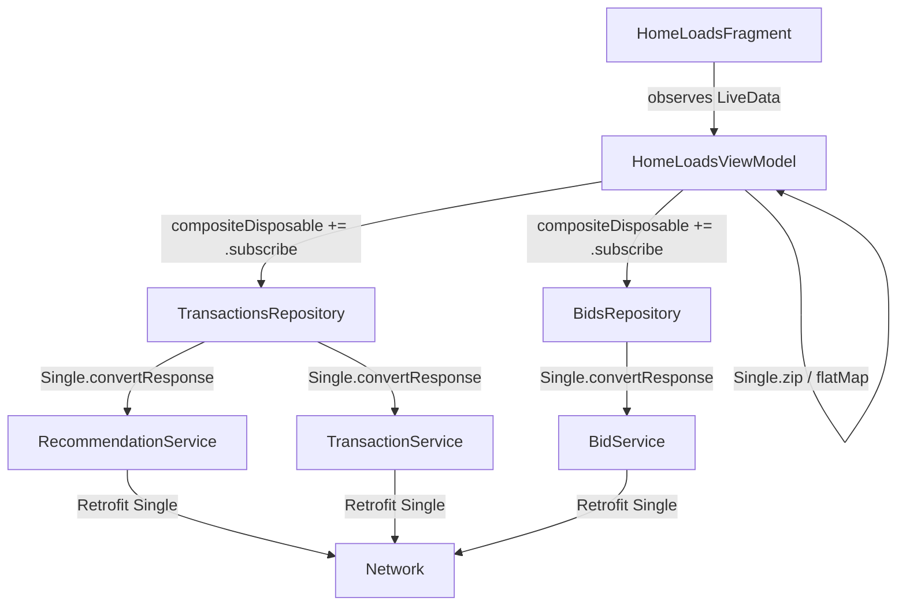
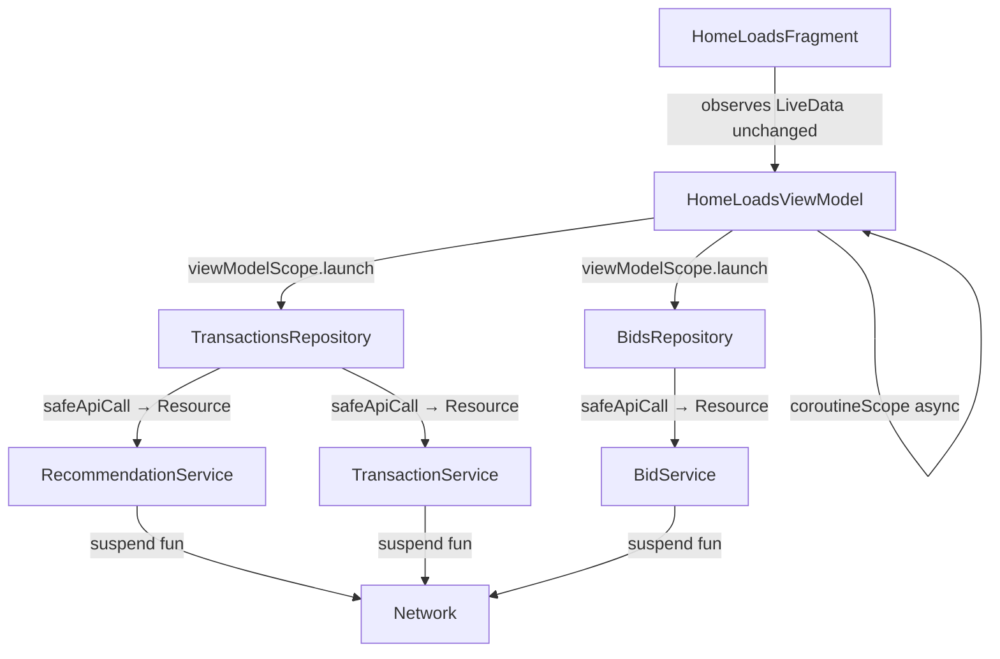
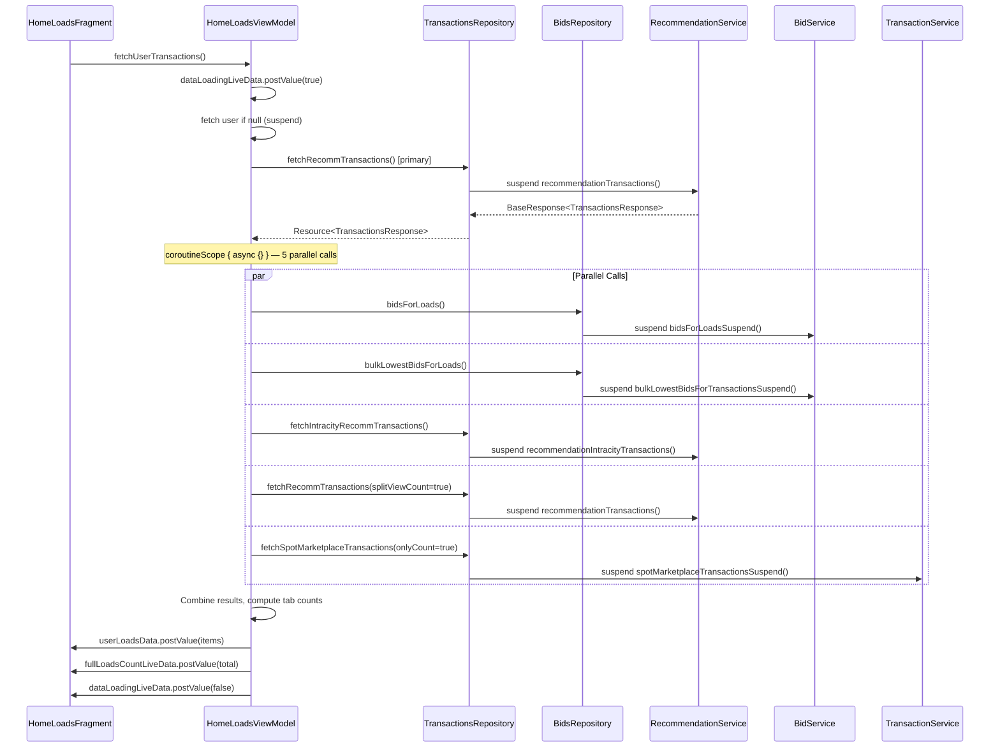
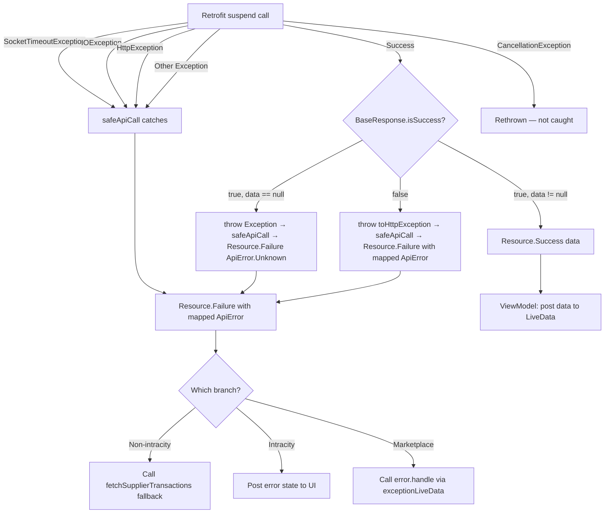

# Design Document: get_sp_loads Coroutine Migration

## Overview

This design covers the migration of the `POST /get_sp_loads` API endpoint flow from RxJava (`Single<BaseResponse<T>>`, `compositeDisposable`, `Single.zip()`, `.flatMap{}`) to pure Kotlin coroutines (`suspend fun`, `safeApiCall`, `Resource<T>`, `viewModelScope.launch`, `coroutineScope { async {} }`).

The migration spans four layers:

1. **Service Layer** — Retrofit interfaces (`RecommendationService`, `BidService`, `TransactionService`) replace `Single<BaseResponse<T>>` return types with `suspend fun` returning `BaseResponse<T>` directly.
2. **Repository Layer** — `TransactionsRepository` and `BidsRepository` replace RxJava methods with `suspend fun` using `safeApiCall` from `BaseRepository`, returning `Resource<T>`.
3. **ViewModel Layer** — `HomeLoadsViewModel` replaces `compositeDisposable += ...subscribe{}` chains, `Single.zip()`, and `.flatMap{}` with `viewModelScope.launch`, sequential suspend calls, and `coroutineScope { async {} }` for parallel execution.
4. **UI Layer** — `HomeLoadsFragment` requires minimal or no changes since the LiveData contract is preserved.

The existing `BaseRepository.safeApiCall`, `Resource` sealed class, `ApiError` enum, and `CoroutineModule` (from the `coroutines-api-state-management` spec) are reused without modification.

### Design Decisions

- **In-place replacement, not additive**: Service and repository methods are replaced in-place (not kept alongside RxJava variants) because the migrated methods are only consumed by `HomeLoadsViewModel`. Other callers (e.g., `SearchResultsViewModel`) use different methods (`searchTransactions`) that remain RxJava.
- **No bridge library**: No `kotlinx-coroutines-rx2` or `Single.await()`. All five parallel calls in the `Single.zip()` are migrated to suspend functions simultaneously.
- **BaseResponse unwrapping inside safeApiCall lambda**: The `convertResponse()` RxJava extension is not used. Instead, each repository method checks `BaseResponse.isSuccess` inside the `safeApiCall` lambda and throws `toHttpException()` on failure, letting `safeApiCall` map it to `Resource.Failure`.
- **LiveData contract preserved**: The ViewModel continues posting to the same `MutableLiveData` fields (`userLoadsData`, `userLoadsDataFetch`, `dataLoadingLiveData`, `loadsCountLiveData`, `fullLoadsCountLiveData`) with the same types, so `HomeLoadsFragment` observers remain unchanged.

## Architecture

### Current Architecture (RxJava)



### Target Architecture (Coroutines)



### Data Flow — Non-Intracity Branch (Primary)




## Components and Interfaces

### Service Layer Changes

#### RecommendationService.kt
Replace both RxJava methods with suspend functions:

```kotlin
interface RecommendationService {
    @POST("/get_sp_loads")
    suspend fun recommendationTransactions(
        @Body request: ReccomdationRequest
    ): BaseResponse<TransactionsResponse>

    @POST("/get_sp_intracity_loads")
    suspend fun recommendationIntracityTransactions(
        @Body request: ReccomdationRequest
    ): BaseResponse<TransactionsResponse>
}
```

Retrofit natively supports `suspend fun` — it internally uses `Call.enqueue()` and resumes the coroutine on the callback. No adapter factory changes needed.

#### BidService.kt
Add suspend variants for the two methods consumed by `HomeLoadsViewModel`:

```kotlin
// New suspend methods (existing RxJava methods remain for other callers)
@GET("bids")
suspend fun bidsForLoadsSuspend(
    @Query("supplier_id") userId: String,
    @Query("transaction_ids") transactionIds: String? = null,
    @Query("contract_bids") contractBids: Boolean? = null
): BaseResponse<TransactionBidsResponseBody>

@GET("/bids/lowest")
suspend fun bulkLowestBidsForTransactionsSuspend(
    @Query("transaction_id_list") transactionIds: String
): BaseResponse<List<LowestBidResponse>>
```

The existing RxJava `bidsForLoads()` and `bulkLowestBidsForTransactions()` are kept because they are used by other callers outside the `get_sp_loads` flow (e.g., `fetchSupplierLoadsData`, `fetchLowestBid`, `bidsForBulkLoads`).

#### TransactionService.kt
Add a suspend variant for `spotMarketplaceTransactions`:

```kotlin
@GET("/v2/spot-marketplace/loads/")
suspend fun spotMarketplaceTransactionsSuspend(
    @Query("only_count") onlyCount: Boolean = false,
    @Query("limit") limit: Int,
    @Query("offset") offset: Int
): BaseResponse<SpotMarketplaceLoadsData>
```

The existing RxJava `spotMarketplaceTransactions()` is kept for callers outside this migration scope.

### Repository Layer Changes

#### TransactionsRepository.kt
Replace the three methods consumed by `HomeLoadsViewModel` with suspend equivalents:

```kotlin
suspend fun fetchRecommTransactions(
    offset: Int, demand_type: String, vehicle_type: String? = null,
    excludeTruckTypes: String? = null, filterVehicleType: Boolean? = null,
    biddingGoingOn: Boolean = false, splitViewCount: Boolean? = null,
    searchAfter: SearchAfter?
): Resource<TransactionsResponse> = safeApiCall {
    val response = recommendationService.recommendationTransactions(
        ReccomdationRequest(
            userPrefs.parentId, UserTripsLoadLimit, offset,
            demand_type, vehicle_type, splitViewCount = splitViewCount,
            searchAfter = searchAfter
        )
    )
    if (response.isSuccess) {
        response.responseData ?: throw Exception("Null response data")
    } else {
        throw response.toHttpException()
    }
}

suspend fun fetchIntracityRecommTransactions(
    offset: Int, demand_type: String? = null, vehicle_type: String? = null,
    excludeTruckTypes: String? = null, filterVehicleType: Boolean? = null,
    biddingGoingOn: Boolean = false, onlyCount: Boolean? = null,
    searchAfter: SearchAfter? = null
): Resource<TransactionsResponse> = safeApiCall {
    val response = recommendationService.recommendationIntracityTransactions(
        ReccomdationRequest(
            userPrefs.parentId, UserTripsLoadLimit, offset,
            null, vehicle_type, onlyCount = onlyCount, searchAfter = searchAfter
        )
    )
    if (response.isSuccess) {
        response.responseData ?: throw Exception("Null response data")
    } else {
        throw response.toHttpException()
    }
}

suspend fun fetchSpotMarketplaceTransactions(
    onlyCount: Boolean = false, limit: Int = UserTripsLoadLimit, offset: Int
): Resource<SpotMarketplaceLoadsData> = safeApiCall {
    val response = transactionService.spotMarketplaceTransactionsSuspend(
        onlyCount = onlyCount, limit = limit, offset = offset
    )
    if (response.isSuccess) {
        response.responseData ?: throw Exception("Null response data")
    } else {
        throw response.toHttpException()
    }
}
```

#### BidsRepository.kt
Replace the two methods consumed by `HomeLoadsViewModel`:

```kotlin
suspend fun bidsForLoads(
    transactions: List<HomeBidsRequestItemData>?,
    contractBids: Boolean? = null
): Resource<Pair<List<HomeBidsRequestItemData>, List<TransactionBid>>> = safeApiCall {
    val response = bidService.bidsForLoadsSuspend(
        userRepository.userId(),
        if (transactions.isNullOrEmpty()) "" else
            transactions.map { it.transactionId }.joinToString(","),
        contractBids
    )
    if (response.isSuccess) {
        Pair(transactions ?: emptyList(), response.responseData!!.bids)
    } else {
        throw response.toHttpException()
    }
}

suspend fun bulkLowestBidsForLoads(
    transactions: List<HomeBidsRequestItemData>?
): Resource<Pair<List<HomeBidsRequestItemData>, BulkLowestBidsResponse>> = safeApiCall {
    val response = bidService.bulkLowestBidsForTransactionsSuspend(
        if (transactions.isNullOrEmpty()) "" else
            transactions.map { it.transactionId }.joinToString(",")
    )
    if (response.isSuccess) {
        Pair(transactions ?: emptyList(), response.responseData!!)
    } else {
        throw response.toHttpException()
    }
}
```

Note: The existing RxJava `bidsForLoads()` and `bulkLowestBidsForLoads()` methods must be renamed (e.g., `bidsForLoadsRx()`, `bulkLowestBidsForLoadsRx()`) since Kotlin does not allow overloading by return type alone. Callers outside this migration scope (e.g., `fetchSupplierLoadsData`, `fetchMarketplaceLoadsData` for the bids-only zip, `fetchLowestBid`) must be updated to call the renamed RxJava variants.

### ViewModel Layer Changes

#### HomeLoadsViewModel.kt — fetchLoadsData()

The core migration replaces the deeply nested `compositeDisposable += repo.fetch...flatMap { Single.zip(...) }.onBackground().subscribe {}` pattern with:

```kotlin
private fun fetchLoadsData(
    paginate: Boolean, demandType: String, selectedFilter: String,
    infoSearch: Boolean, excludeTruckTypes: String?
) {
    viewModelScope.launch {
        val mainTrace = Firebase.performance.newTrace("fetch_recommended_transactions")
        val parallelTrace = Firebase.performance.newTrace("fetch_bids_for_recommended_transactions_parallel")
        mainTrace.start()

        if (selectedFilter == DemandType.Intracity.type) {
            // --- Intracity branch ---
            val primaryResult = transactionsRepository.fetchIntracityRecommTransactions(
                offset, demandType, vehicleTypes, excludeTruckTypes,
                filterVehicleType, true, null, searchAfter
            )
            when (primaryResult) {
                is Resource.Success -> {
                    val res = primaryResult.data!!
                    // Update pagination state
                    offset = res.offset ?: 0
                    total = res.transactions?.size ?: 0
                    searchAfter = res.searchAfter
                    if (total == 0) { searchAfter = null; hasMoreData = false }
                    // ... (same state updates as current code)

                    // Parallel calls for split counts + marketplace
                    val parallelResults = coroutineScope {
                        val splitCountDeferred = async {
                            transactionsRepository.fetchRecommTransactions(
                                offset, filterDemandTypeForRecommendations(userPrefs.demandType),
                                vehicleTypes, excludeTruckTypes, filterVehicleType,
                                true, splitViewCount = true, searchAfter = null
                            )
                        }
                        val marketplaceDeferred = async {
                            if (hasMarketplaceAccess) {
                                transactionsRepository.fetchSpotMarketplaceTransactions(
                                    onlyCount = true, limit = 100, offset = 0
                                )
                            } else {
                                Resource.Success(SpotMarketplaceLoadsData(
                                    totalCount = 0, limit = 0, offset = 0,
                                    hasNext = false, transactions = emptyList()
                                ))
                            }
                        }
                        Pair(splitCountDeferred.await(), marketplaceDeferred.await())
                    }
                    // Build UI items list and post to userLoadsData
                    // (same logic as current subscribe success block)
                }
                is Resource.Failure -> {
                    // Post error state to UI
                }
                is Resource.Loading -> { /* not expected here */ }
            }
        } else {
            // --- Non-intracity branch ---
            val primaryResult = transactionsRepository.fetchRecommTransactions(
                offset, filterDemandTypeForRecommendations(userPrefs.demandType),
                vehicleTypes, excludeTruckTypes, filterVehicleType,
                true, searchAfter = searchAfter
            )
            when (primaryResult) {
                is Resource.Success -> {
                    val res = primaryResult.data!!
                    // Update pagination state (same as current)
                    searchAfter = res.searchAfter
                    hasMoreData = searchAfter != null
                    // ...

                    parallelTrace.start()
                    // 5 parallel calls replacing Single.zip()
                    val parallelResults = coroutineScope {
                        val bidsDeferred = async {
                            bidsRepository.bidsForLoads(res.transactions)
                        }
                        val lowestBidsDeferred = async {
                            bidsRepository.bulkLowestBidsForLoads(res.transactions)
                        }
                        val intracityDeferred = async {
                            transactionsRepository.fetchIntracityRecommTransactions(
                                offset, userPrefs.demandType, vehicleTypes,
                                excludeTruckTypes, filterVehicleType, true
                            )
                        }
                        val splitCountDeferred = async {
                            transactionsRepository.fetchRecommTransactions(
                                offset, filterDemandTypeForRecommendations(userPrefs.demandType),
                                vehicleTypes, excludeTruckTypes, filterVehicleType,
                                true, splitViewCount = true, searchAfter = null
                            )
                        }
                        val marketplaceDeferred = async {
                            if (hasMarketplaceAccess) {
                                transactionsRepository.fetchSpotMarketplaceTransactions(
                                    onlyCount = true, limit = 100, offset = 0
                                )
                            } else {
                                Resource.Success(SpotMarketplaceLoadsData(
                                    totalCount = 0, limit = 0, offset = 0,
                                    hasNext = false, transactions = emptyList()
                                ))
                            }
                        }
                        // Await all
                        data class ParallelResults(
                            val bids: Resource<Pair<List<HomeBidsRequestItemData>, List<TransactionBid>>>,
                            val lowestBids: Resource<Pair<List<HomeBidsRequestItemData>, BulkLowestBidsResponse>>,
                            val intracity: Resource<TransactionsResponse>,
                            val splitCount: Resource<TransactionsResponse>,
                            val marketplace: Resource<SpotMarketplaceLoadsData>
                        )
                        ParallelResults(
                            bidsDeferred.await(),
                            lowestBidsDeferred.await(),
                            intracityDeferred.await(),
                            splitCountDeferred.await(),
                            marketplaceDeferred.await()
                        )
                    }
                    parallelTrace.stop()
                    // Build UI items and post to userLoadsData
                    // (same logic as current subscribe success block)
                }
                is Resource.Failure -> {
                    // Fallback to supplier loads
                    fetchSupplierTransactions(
                        totalFetchTitle > 0, selectedFilter,
                        demandType, infoSearch, excludeTruckTypes
                    )
                }
                is Resource.Loading -> { /* not expected here */ }
            }
        }
        mainTrace.stop()
        dataLoadingLiveData.postValue(false)
    }
}
```

Key translation patterns:
- `compositeDisposable += repo.fetch().flatMap { ... }.onBackground().subscribe { result, error -> }` → `viewModelScope.launch { val result = repo.fetch(); when(result) { ... } }`
- `Single.zip(call1, call2, ..., combiner)` → `coroutineScope { val d1 = async { call1() }; val d2 = async { call2() }; combine(d1.await(), d2.await()) }`
- `error?.handle()` → `Resource.Failure` branch with specific `ApiError` handling
- Lifecycle cancellation: `compositeDisposable.disposeAndClear()` in `onCleared()` → `viewModelScope` auto-cancels

#### HomeLoadsViewModel.kt — fetchMarketplaceLoadsData()

Same pattern: replace `compositeDisposable += ...flatMap { Single.zip(...) }.subscribe {}` with `viewModelScope.launch` + sequential suspend calls + `coroutineScope { async {} }` for the bids parallel calls.

#### HomeLoadsViewModel.kt — fetchUserTransactions() / fetchSpotMarketplaceLoads()

The user-fetch-first pattern (`if (user == null) { compositeDisposable += userRepository.getUser().subscribe { ... } }`) is migrated to:

```kotlin
fun fetchUserTransactions(...) {
    // ... pagination setup, dataLoadingLiveData.postValue(true)
    viewModelScope.launch {
        if (user == null) {
            // UserRepository.getUser() is still RxJava — use withContext or keep as-is
            // Since getUser is outside migration scope, use the existing RxJava call
            // OR migrate getUser to suspend (recommended for consistency)
        }
        fetchLoadsData(paginate, demandType, selectedFilter, infoSearch, excludeTruckTypes)
    }
}
```

Note: `userRepository.getUser()` is outside the scope of this migration. The entry-point methods will wrap the existing RxJava `getUser()` call using `suspendCancellableCoroutine` or keep the existing pattern where `fetchLoadsData` is called from the subscribe callback. The recommended approach is to keep the user-fetch as RxJava in the entry point and only migrate `fetchLoadsData`/`fetchMarketplaceLoadsData` to coroutines.

### UI Layer — HomeLoadsFragment.kt

No changes required. The ViewModel continues posting to the same LiveData fields with the same types:
- `userLoadsData: MutableLiveData<List<Pair<BaseHomeLoadsRVAdapterItem<*>, DataRVAdapterOperationType>>>`
- `userLoadsDataFetch: MutableLiveData<List<Pair<...>>>`
- `dataLoadingLiveData: MutableLiveData<Boolean>`
- `loadsCountLiveData: MutableLiveData<Int>`
- `fullLoadsCountLiveData: MutableLiveData<Int>`

The Fragment's `reobserve(viewLifecycleOwner)` calls remain unchanged.


## Data Models

No data model changes are required. All existing models are reused as-is:

| Model | Package | Role | Changed? |
|-------|---------|------|----------|
| `ReccomdationRequest` | `api.request` | Request body for `get_sp_loads` / `get_sp_intracity_loads` | No |
| `BaseResponse<T>` | `api.response` | API response wrapper with `isSuccess`, `responseData`, `errorBody` | No |
| `TransactionsResponse` | `api.response` | Response containing `transactions`, `total`, `offset`, `hasNext`, `searchAfter`, `loadCounts` | No |
| `SpotMarketplaceLoadsData` | `api.response` | Marketplace response with `totalCount`, `transactions`, `hasNext` | No |
| `HomeBidsRequestItemData` | `data.home.bids` | Individual load item used in RecyclerView | No |
| `TransactionBid` | `data.bids` | Bid data for a transaction | No |
| `LowestBidResponse` | `api.response` | Lowest bid info per transaction | No |
| `TransactionBidsResponseBody` | `api.response` | Bids response with `bids` list and `totalBids` | No |
| `SearchAfter` | `api.response` | Pagination cursor (`creationTime`, `transactionId`, `requiredOn`) | No |
| `LoadCounts` | `api.response` | Split counts by load type (`INTERCITY`, `NON_DELHIVERY`) | No |
| `Resource<T>` | `api.repository` | Sealed class: `Loading`, `Success(data)`, `Failure(isNetworkError, errorCode, apiError)` | No |
| `ApiError` | `api.repository` | Error enum: `Timeout`, `Network`, `Unauthorized`, `AccessDenied`, `NotFound`, `ServiceUnavailable`, `Unknown` | No |

### State Management in ViewModel

The following mutable state fields in `HomeLoadsViewModel` are preserved with identical semantics:

- `searchAfter: SearchAfter?` — Pagination cursor, updated from `TransactionsResponse.searchAfter`
- `hasMoreData: Boolean` — Controls pagination, set to `false` when `searchAfter` is null or transactions are empty
- `offset: Int` — Current offset for API calls
- `total: Int` — Count of transactions in current response
- `loadsCount: Int` — Accumulated count across paginated fetches
- `cachedMarketplaceCount: Int` — Cached marketplace count for cross-tab display
- `txnIds: ArrayList<String>` — Accumulated transaction IDs for deduplication


## Correctness Properties

*A property is a characteristic or behavior that should hold true across all valid executions of a system — essentially, a formal statement about what the system should do. Properties serve as the bridge between human-readable specifications and machine-verifiable correctness guarantees.*

The prework analysis identified 8 consolidated properties after eliminating redundancy. Properties 2.1–2.5 (individual repository methods) were subsumed by the generalized properties 2.6/2.7. Properties 11.1–11.4 (exception-to-ApiError mapping) are already covered by existing `BaseRepository` tests from the `coroutines-api-state-management` spec, so only the new `BaseResponse.isSuccess=false → toHttpException()` chain (11.5) is included. Properties 4.1/4.2 were combined into a loading state round-trip. Properties 6.1/6.2/6.4 were combined into pagination consistency. Properties 8.1/8.3/8.4 were combined into tab count aggregation.

### Property 1: Repository success unwrapping

*For any* repository method that wraps `safeApiCall`, and *for any* `BaseResponse` where `isSuccess == true` and `responseData` is non-null, the method shall return `Resource.Success` containing the unwrapped `responseData`.

**Validates: Requirements 2.6**

### Property 2: Repository failure mapping via toHttpException

*For any* repository method that wraps `safeApiCall`, and *for any* `BaseResponse` where `isSuccess == false` with an `errorBody` containing an error code, the method shall return `Resource.Failure` where `apiError` matches the `ApiError` corresponding to that error code (e.g., 401 → `Unauthorized`, 403 → `AccessDenied`, 404 → `NotFound`, other → `Unknown`).

**Validates: Requirements 2.7, 11.5**

### Property 3: Loading state round trip

*For any* invocation of `fetchLoadsData` or `fetchMarketplaceLoadsData` (regardless of success or failure outcome), `dataLoadingLiveData` shall receive `true` before any API call begins and `false` after the method completes.

**Validates: Requirements 4.1, 4.2**

### Property 4: Pagination state consistency

*For any* successful `fetchRecommTransactions` response, the ViewModel's `searchAfter` field shall equal `TransactionsResponse.searchAfter`, and `hasMoreData` shall be `true` if and only if `searchAfter` is non-null and `transactions` is non-empty. Furthermore, *for any* state where `hasMoreData == false`, calling `fetchUserTransactions(paginate = true)` shall return early without making an API call.

**Validates: Requirements 6.1, 6.2, 6.4**

### Property 5: Tab count aggregation

*For any* `loadCounts` response from the split-view-count call, the value posted to `fullLoadsCountLiveData` shall equal the sum of: the intracity count (from the intracity response `total`), the `INTERCITY` count extracted from `loadCounts.all`, the `NON_DELHIVERY` count extracted from `loadCounts.all`, and the marketplace `totalCount`. When `loadCounts` is null, `INTERCITY` and `NON_DELHIVERY` counts shall default to 0.

**Validates: Requirements 8.1, 8.3, 8.4**

### Property 6: Parallel call failure cancels siblings

*For any* set of parallel `async` calls within `coroutineScope`, if any single call returns `Resource.Failure` (by throwing an exception internally), all sibling coroutines shall be cancelled and no partial results shall be posted to LiveData.

**Validates: Requirements 7.2**

### Property 7: Parallel call success produces combined result

*For any* set of successful parallel call results (bids, lowestBids, intracity, splitCount, marketplace), the ViewModel shall combine them into the same data structure as the current `Single.zip()` combiner — specifically, the loads list from the primary call, the bids list, the lowest bids list, the intracity total, the split-view counts, and the marketplace count shall all be present in the posted `userLoadsData` items.

**Validates: Requirements 7.3**

### Property 8: CancellationException propagation

*For any* `CancellationException` thrown during a `safeApiCall` execution, the exception shall be rethrown (not caught and mapped to `Resource.Failure`), allowing structured concurrency cancellation to propagate correctly.

**Validates: Requirements 10.3**


## Error Handling

### Error Flow: Service → Repository → ViewModel → UI



### Error Mapping (Existing — No Changes)

| Exception | `isNetworkError` | `errorCode` | `ApiError` |
|-----------|-----------------|-------------|------------|
| `SocketTimeoutException` | `true` | `null` | `Timeout` |
| `IOException` | `true` | `null` | `Network` |
| `HttpException(401)` | `false` | `401` | `Unauthorized` |
| `HttpException(403)` | `false` | `403` | `AccessDenied` |
| `HttpException(404)` | `false` | `404` | `NotFound` |
| `HttpException(503)` | `false` | `503` | `ServiceUnavailable` |
| `HttpException(other)` | `false` | `code` | `Unknown` |
| `Exception` (other) | `false` | `null` | `Unknown` |
| `CancellationException` | — | — | Rethrown |

### BaseResponse.isSuccess == false Handling

This is the critical new error path. In the RxJava flow, `convertResponse()` checks `isSuccess` and throws `toHttpException()`. In the coroutine flow, this check moves inside the `safeApiCall` lambda:

```kotlin
safeApiCall {
    val response = service.suspendMethod(request)
    if (response.isSuccess) {
        response.responseData ?: throw Exception("Null response data")
    } else {
        throw response.toHttpException()  // HttpException with error code from BaseErrorResponse
    }
}
```

`BaseResponse.toHttpException()` creates an `HttpException` with the error code from `BaseErrorResponse.errorCode()` (defaulting to 400). `safeApiCall` then catches this `HttpException` and maps it via `mapHttpCodeToApiError()`.

### Fallback Behavior

The non-intracity branch has a critical fallback: when `fetchRecommTransactions` fails, the ViewModel calls `fetchSupplierTransactions()` instead of showing an error. This fallback is preserved in the coroutine migration:

```kotlin
when (primaryResult) {
    is Resource.Failure -> {
        fetchSupplierTransactions(
            totalFetchTitle > 0, selectedFilter, demandType, infoSearch, excludeTruckTypes
        )
    }
    // ...
}
```

The intracity branch does NOT have this fallback — errors are posted directly to the UI.

### Coroutine Cancellation

- `viewModelScope.launch` ties coroutines to ViewModel lifecycle. When `onCleared()` is called, all coroutines are cancelled automatically.
- `coroutineScope { async {} }` provides structured concurrency — if any `async` block fails, all siblings are cancelled.
- `CancellationException` is always rethrown by `safeApiCall`, ensuring cancellation propagates correctly.
- Rapid tab switching: a new `viewModelScope.launch` does NOT automatically cancel a previous launch. To handle this, the ViewModel should store the current `Job` and cancel it before launching a new fetch:

```kotlin
private var currentFetchJob: Job? = null

fun fetchUserTransactions(...) {
    currentFetchJob?.cancel()
    currentFetchJob = viewModelScope.launch {
        // ... fetch logic
    }
}
```

## Testing Strategy

### Property-Based Testing Library

Use **Kotest** property-based testing (`io.kotest:kotest-property:5.8.0`) for Kotlin. Kotest integrates with JUnit 5 and provides `checkAll` for property-based tests with configurable iteration counts.

Add to `app/build.gradle`:
```groovy
testImplementation 'io.kotest:kotest-runner-junit5:5.8.0'
testImplementation 'io.kotest:kotest-property:5.8.0'
testImplementation 'io.kotest:kotest-assertions-core:5.8.0'
```

### Dual Testing Approach

Both unit tests and property-based tests are required:

- **Unit tests**: Verify specific examples, edge cases, integration points, and error conditions with concrete inputs.
- **Property tests**: Verify universal properties across randomly generated inputs with minimum 100 iterations per property.

### Property-Based Tests

Each correctness property maps to a single property-based test. Each test must be tagged with a comment referencing the design property.

| Property | Test File | Description |
|----------|-----------|-------------|
| P1 | `TransactionsRepositoryTest.kt` | Generate random `BaseResponse(isSuccess=true, data=randomTransactionsResponse)`, verify `Resource.Success(data)` |
| P2 | `TransactionsRepositoryTest.kt` | Generate random `BaseResponse(isSuccess=false, errorBody=randomErrorBody)`, verify `Resource.Failure` with correct `ApiError` |
| P3 | `HomeLoadsViewModelTest.kt` | Generate random fetch parameters, verify `dataLoadingLiveData` transitions `true → false` |
| P4 | `HomeLoadsViewModelTest.kt` | Generate random `TransactionsResponse` with varying `searchAfter`/`transactions`, verify pagination state consistency |
| P5 | `HomeLoadsViewModelTest.kt` | Generate random `loadCounts` with varying `INTERCITY`/`NON_DELHIVERY` counts, verify `fullLoadsCountLiveData` equals sum |
| P6 | `HomeLoadsViewModelTest.kt` | Generate random parallel call configurations where one fails, verify no partial LiveData posts |
| P7 | `HomeLoadsViewModelTest.kt` | Generate random successful parallel results, verify combined output matches expected structure |
| P8 | `BaseRepositoryTest.kt` | Already covered by existing tests — verify `CancellationException` is rethrown |

### Property Test Tag Format

Each property test must include a comment tag:
```kotlin
// Feature: get-sp-loads-coroutine-migration, Property 1: Repository success unwrapping
```

### Property Test Configuration

- Minimum 100 iterations per property test (Kotest default is 1000, which is fine)
- Use `Arb.bind()` to generate complex data classes like `TransactionsResponse`, `BaseResponse`, `LoadCounts`
- Use `Arb.int()`, `Arb.string()`, `Arb.boolean()` for primitive fields

### Unit Tests (Specific Examples and Edge Cases)

| Test | File | Description |
|------|------|-------------|
| Intracity branch success | `HomeLoadsViewModelTest.kt` | Mock intracity response, verify `userLoadsData` posted with correct items |
| Non-intracity branch success | `HomeLoadsViewModelTest.kt` | Mock all 5 parallel responses, verify combined `userLoadsData` |
| Non-intracity fallback on error | `HomeLoadsViewModelTest.kt` | Mock primary call failure, verify `fetchSupplierTransactions` called |
| Intracity no fallback on error | `HomeLoadsViewModelTest.kt` | Mock intracity failure, verify no supplier fallback |
| Pagination progress item | `HomeLoadsViewModelTest.kt` | Call with `paginate=true`, verify `HomeLoadsProgressItem` posted |
| Null responseData edge case | `TransactionsRepositoryTest.kt` | Mock `BaseResponse(isSuccess=true, data=null)`, verify `Resource.Failure(ApiError.Unknown)` |
| Null loadCounts edge case | `HomeLoadsViewModelTest.kt` | Mock response with `loadCounts=null`, verify counts default to 0 |
| Empty transactions edge case | `HomeLoadsViewModelTest.kt` | Mock response with empty transactions, verify `hasMoreData=false` |
| ViewModel onCleared cancellation | `HomeLoadsViewModelTest.kt` | Start fetch, call `onCleared()`, verify no LiveData updates after |
| Rapid tab switching | `HomeLoadsViewModelTest.kt` | Launch two fetches rapidly, verify first is cancelled |
| Entry point calls coroutine method | `HomeLoadsViewModelTest.kt` | Call `fetchUserTransactions()`, verify coroutine-based fetch is invoked |
| Build validation | Manual | `./gradlew assembleDevelopmentDebug` compiles without errors |

### Test Dependencies

```groovy
testImplementation 'org.jetbrains.kotlinx:kotlinx-coroutines-test:1.7.3'
testImplementation 'androidx.arch.core:core-testing:2.2.0'
testImplementation 'io.mockk:mockk:1.13.8'
testImplementation 'io.kotest:kotest-runner-junit5:5.8.0'
testImplementation 'io.kotest:kotest-property:5.8.0'
testImplementation 'io.kotest:kotest-assertions-core:5.8.0'
```

- `kotlinx-coroutines-test`: Provides `runTest`, `TestDispatcher`, `advanceUntilIdle` for coroutine testing
- `core-testing`: Provides `InstantTaskExecutorRule` for LiveData testing
- `mockk`: Kotlin-first mocking library for mocking services and repositories
- `kotest-property`: Property-based testing with `checkAll` and `Arb` generators

### Files to Create/Modify

| File | Action |
|------|--------|
| `app/src/test/java/com/delhivery/axle/api/repository/TransactionsRepositoryTest.kt` | Create — property tests P1, P2 + unit tests for edge cases |
| `app/src/test/java/com/delhivery/axle/api/repository/BidsRepositoryTest.kt` | Create — property tests P1, P2 for bids repository methods |
| `app/src/test/java/com/delhivery/axle/ui/home/fragments/loads/HomeLoadsViewModelTest.kt` | Create — property tests P3-P7 + unit tests for branches/fallback/edge cases |
| `app/build.gradle` | Modify — add Kotest and MockK test dependencies |

