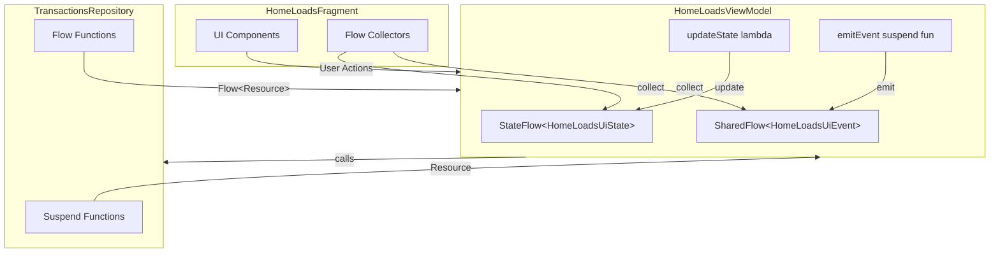

# Design Document: HomeLoads Flow Migration

## Overview

This design document describes the migration of HomeLoadsViewModel from LiveData with pure coroutines to Kotlin Flow APIs (StateFlow, SharedFlow). The migration modernizes the reactive data handling in the loads screen, improving lifecycle awareness, reducing boilerplate, and enabling better state management patterns.

### Goals
- Replace scattered LiveData properties with a single StateFlow-backed UI state
- Replace one-time event LiveData with SharedFlow to prevent event replay on configuration changes
- Maintain backward compatibility with existing RxJava-based code paths
- Preserve coroutine job cancellation behavior for rapid tab switching
- Enable better unit testing through immutable state and predictable event emission

### Non-Goals
- Migrating RxJava code in repositories to Flow (out of scope)
- Migrating progressLiveData (retained for legacy dialog integration)
- Changing the existing UI/UX behavior

## Architecture

The migration follows the unidirectional data flow (UDF) pattern:



### Data Flow

1. **User Action** → Fragment calls ViewModel method
2. **ViewModel** → Cancels existing job, launches new coroutine
3. **Repository** → Returns Resource (suspend) or Flow<Resource>
4. **ViewModel** → Updates `_uiState` via `update {}` or emits to `_uiEvent`
5. **Fragment** → Collects StateFlow/SharedFlow with `repeatOnLifecycle`
6. **UI** → Renders based on collected state/events

## Components and Interfaces

### HomeLoadsUiState Data Class

Centralized immutable state container replacing multiple LiveData properties:

```kotlin
data class HomeLoadsUiState(
    // Loads data
    val loads: List<Pair<BaseHomeLoadsRVAdapterItem<*>, DataRVAdapterOperationType>> = emptyList(),
    val loadsFetch: List<Pair<BaseHomeLoadsRVAdapterItem<*>, DataRVAdapterOperationType>> = emptyList(),
    
    // Loading states
    val isLoading: Boolean = false,
    val isLoadingMore: Boolean = false,
    
    // Pagination state
    val hasMoreData: Boolean = true,
    val offset: Int = 0,
    val total: Int = 0,
    val searchAfter: SearchAfter? = null,
    
    // Filter state
    val selectedFilter: String = "",
    val vehicleTypes: String? = null,
    val filterVehicleType: Boolean? = null,
    
    // Tab counts
    val intracityCount: Int = 0,
    val intercityCount: Int = 0,
    val nonDlvCount: Int = 0,
    val marketplaceCount: Int = 0,
    val fullLoadsCount: Int = 0,
    val loadsCount: Int = 0,
    
    // Routes state
    val hasRoutes: Boolean = false,
    
    // Error state
    val error: ApiError? = null,
    val isNetworkError: Boolean = false
)
```

### HomeLoadsUiEvent Sealed Class

One-time events that should not be replayed on configuration changes:

```kotlin
sealed class HomeLoadsUiEvent {
    // Bid action events
    data class BidActionResult(val position: Int, val bid: TransactionBid) : HomeLoadsUiEvent()
    data class BulkBidActionResult(val position: Int, val bids: List<TransactionBid>) : HomeLoadsUiEvent()
    data class AcceptBidResult(val position: Int, val result: Any) : HomeLoadsUiEvent()
    data class LowestBidResult(val position: Int, val data: HomeBidsRequestItemData) : HomeLoadsUiEvent()
    data class ReviseBid(val shouldRevise: Boolean, val position: Int) : HomeLoadsUiEvent()
    data class EditBulkResult(val code: Int, val transactionId: String) : HomeLoadsUiEvent()
    
    // Truck events
    data class TruckTypesLoaded(val trucks: List<TruckResponseArray>, val data: HomeBidsRequestItemData) : HomeLoadsUiEvent()
    
    // Analytics tracking events
    object TrackIntracityListShown : HomeLoadsUiEvent()
    object TrackIntercityListShown : HomeLoadsUiEvent()
    object TrackMarketplaceListShown : HomeLoadsUiEvent()
    
    // Error events
    data class ShowErrorToast(val message: String) : HomeLoadsUiEvent()
    data class ShowError(val error: ApiError) : HomeLoadsUiEvent()
}
```

### ViewModel Flow Properties

```kotlin
class HomeLoadsViewModel @Inject constructor(
    private val transactionsRepository: TransactionsRepository,
    // ... other dependencies
) : BaseViewModel() {

    // Private mutable flows
    private val _uiState = MutableStateFlow(HomeLoadsUiState())
    private val _uiEvent = MutableSharedFlow<HomeLoadsUiEvent>(
        replay = 0,
        extraBufferCapacity = 64,
        onBufferOverflow = BufferOverflow.DROP_OLDEST
    )
    
    // Public immutable flows
    val uiState: StateFlow<HomeLoadsUiState> = _uiState.asStateFlow()
    val uiEvent: SharedFlow<HomeLoadsUiEvent> = _uiEvent.asSharedFlow()
    
    // Retained for legacy dialog integration
    val progressLiveData = MutableLiveData<Boolean>()
    
    // Job cancellation for rapid tab switching
    private var currentFetchJob: Job? = null
}
```

### State Update Helper Functions

```kotlin
// Atomic state update using MutableStateFlow.update {}
private fun updateState(transform: (HomeLoadsUiState) -> HomeLoadsUiState) {
    _uiState.update(transform)
}

// Suspend function for emitting one-time events
private suspend fun emitEvent(event: HomeLoadsUiEvent) {
    _uiEvent.emit(event)
}

// Non-suspend version using tryEmit for fire-and-forget scenarios
private fun sendEvent(event: HomeLoadsUiEvent) {
    _uiEvent.tryEmit(event)
}
```

### Fragment Flow Collection

```kotlin
class HomeLoadsFragment : HomeLoadsTruckBaseFragment<...>() {

    override fun onViewCreated(view: View, savedInstanceState: Bundle?) {
        super.onViewCreated(view, savedInstanceState)
        
        // Collect UI state
        viewLifecycleOwner.lifecycleScope.launch {
            viewLifecycleOwner.repeatOnLifecycle(Lifecycle.State.STARTED) {
                launch {
                    viewModel.uiState.collect { state ->
                        renderState(state)
                    }
                }
                
                launch {
                    viewModel.uiEvent.collect { event ->
                        handleEvent(event)
                    }
                }
            }
        }
        
        // Retain progressLiveData observation for legacy dialog
        viewModel.progressLiveData.observe(viewLifecycleOwner, ProgressObserver())
    }
    
    private fun renderState(state: HomeLoadsUiState) {
        // Update adapter with loads
        if (state.loads.isNotEmpty()) {
            adapter.operation(state.loads)
        }
        if (state.loadsFetch.isNotEmpty()) {
            adapter.operation(state.loadsFetch)
        }
        
        // Update tab counts
        HomeLoadsTruckFragment._instance.dataToUpdate(
            type = "loads",
            showBadge = true,
            count = state.fullLoadsCount
        )
        
        // Update routes banner visibility
        binding.routesBanner.visibility = if (state.hasRoutes) View.GONE else View.VISIBLE
        
        // Update loading state
        isLoadingData = state.isLoading
    }
    
    private fun handleEvent(event: HomeLoadsUiEvent) {
        when (event) {
            is HomeLoadsUiEvent.BidActionResult -> handleBidAction(event)
            is HomeLoadsUiEvent.BulkBidActionResult -> handleBulkBidAction(event)
            is HomeLoadsUiEvent.AcceptBidResult -> handleAcceptBid(event)
            is HomeLoadsUiEvent.LowestBidResult -> handleLowestBid(event)
            is HomeLoadsUiEvent.ReviseBid -> handleReviseBid(event)
            is HomeLoadsUiEvent.EditBulkResult -> handleEditBulk(event)
            is HomeLoadsUiEvent.TruckTypesLoaded -> handleTruckTypes(event)
            is HomeLoadsUiEvent.TrackIntracityListShown -> trackIntracityListShown()
            is HomeLoadsUiEvent.TrackIntercityListShown -> trackIntercityListShown()
            is HomeLoadsUiEvent.TrackMarketplaceListShown -> trackMarketplaceListShown()
            is HomeLoadsUiEvent.ShowErrorToast -> showToast(event.message)
            is HomeLoadsUiEvent.ShowError -> handleError(event.error)
        }
    }
}
```

### Repository Flow Extension

Add `safeApiCallFlow` to BaseRepository for Flow-based API calls:

```kotlin
abstract class BaseRepository(private val errorLogger: ErrorLogger) {
    
    /**
     * Wraps an API call in a Flow that emits Loading, then Success or Failure.
     */
    fun <T> safeApiCallFlow(
        apiCall: suspend () -> T
    ): Flow<Resource<T>> = flow {
        emit(Resource.Loading)
        try {
            emit(Resource.Success(apiCall()))
        } catch (e: CancellationException) {
            throw e
        } catch (e: SocketTimeoutException) {
            errorLogger.log(e)
            emit(Resource.Failure(isNetworkError = true, errorCode = null, apiError = ApiError.Timeout))
        } catch (e: IOException) {
            errorLogger.log(e)
            emit(Resource.Failure(isNetworkError = true, errorCode = null, apiError = ApiError.Network))
        } catch (e: HttpException) {
            errorLogger.log(e)
            emit(Resource.Failure(isNetworkError = false, errorCode = e.code(), apiError = mapHttpCodeToApiError(e.code())))
        } catch (e: Exception) {
            errorLogger.log(e)
            emit(Resource.Failure(isNetworkError = false, errorCode = null, apiError = ApiError.Unknown))
        }
    }.flowOn(Dispatchers.IO)
}
```

## Data Models

### LiveData to Flow Migration Mapping

| Current LiveData | Migration Target | Type |
|-----------------|------------------|------|
| `userLoadsData` | `uiState.loads` | StateFlow |
| `userLoadsDataFetch` | `uiState.loadsFetch` | StateFlow |
| `routesLiveData` | `uiState.hasRoutes` | StateFlow |
| `loadsCountLiveData` | `uiState.loadsCount` | StateFlow |
| `fullLoadsCountLiveData` | `uiState.fullLoadsCount` | StateFlow |
| `dataLoadingLiveData` | `uiState.isLoading` | StateFlow |
| `bidsActionLiveData` | `BidActionResult` | SharedFlow |
| `bulkBidActionLiveData` | `BulkBidActionResult` | SharedFlow |
| `acceptBidLiveData` | `AcceptBidResult` | SharedFlow |
| `lowestBidLiveData` | `LowestBidResult` | SharedFlow |
| `reviseBidLiveData` | `ReviseBid` | SharedFlow |
| `truckGetLiveData` | `TruckTypesLoaded` | SharedFlow |
| `editBulkLiveData` | `EditBulkResult` | SharedFlow |
| `intercityListShownTracked` | `TrackIntercityListShown` | SharedFlow |
| `intracityListShownTracked` | `TrackIntracityListShown` | SharedFlow |
| `marketPlaceListShownTracked` | `TrackMarketplaceListShown` | SharedFlow |
| `progressLiveData` | **Retained as LiveData** | LiveData |

### Pagination State Fields

```kotlin
// In HomeLoadsUiState
val hasMoreData: Boolean = true      // Whether more pages exist
val isLoadingMore: Boolean = false   // Currently loading next page
val offset: Int = 0                  // Current pagination offset
val total: Int = 0                   // Total items count
val searchAfter: SearchAfter? = null // Cursor for cursor-based pagination
```

### Filter State Fields

```kotlin
// In HomeLoadsUiState
val selectedFilter: String = ""           // Current filter selection (Intracity, Internal, etc.)
val vehicleTypes: String? = null          // Vehicle type filter
val filterVehicleType: Boolean? = null    // Whether to filter by vehicle type
```

## Correctness Properties

*A property is a characteristic or behavior that should hold true across all valid executions of a system—essentially, a formal statement about what the system should do. Properties serve as the bridge between human-readable specifications and machine-verifiable correctness guarantees.*

### Property 1: SharedFlow Event Single Consumption

*For any* UI event emitted to the SharedFlow, a collector that starts collecting after the emission should NOT receive that event, ensuring events are consumed exactly once and not replayed on configuration changes.

**Validates: Requirements 2.4, 4.3**

### Property 2: Immutable State Updates via Copy

*For any* state update operation in the ViewModel, the new state instance should be referentially different from the previous state instance (new object created via copy()), while unchanged fields retain their values.

**Validates: Requirements 3.3**

### Property 3: Flow Emission Sequence

*For any* Flow-returning repository method, the emission sequence should be: first `Resource.Loading`, then exactly one of `Resource.Success` or `Resource.Failure`, with no emissions after the terminal state.

**Validates: Requirements 6.2, 6.3**

### Property 4: StateFlow Conflation

*For any* rapid sequence of state updates (N updates in quick succession), the collector should receive at most N emissions, and the final collected state should always equal the last emitted state (conflation behavior).

**Validates: Requirements 7.4**

### Property 5: Pagination State Transitions

*For any* pagination trigger, the state should transition through: `isLoadingMore = true` → API call → `isLoadingMore = false` with updated `hasMoreData` and `offset` reflecting the API response.

**Validates: Requirements 9.2, 9.3**

### Property 6: Filter Change Triggers Refresh

*For any* filter change operation, the ViewModel should update `selectedFilter` in state AND initiate a data refresh, resulting in new loads being fetched for the selected filter.

**Validates: Requirements 10.2**

### Property 7: Atomic Count Updates

*For any* count fetch operation that returns multiple counts (intracity, intercity, nonDlv, marketplace), all count properties should be updated in a single atomic state emission, not in separate emissions.

**Validates: Requirements 11.2, 14.3**

### Property 8: Job Cancellation Behavior

*For any* new fetch initiation while a previous fetch is in progress: (a) the previous job should be cancelled, (b) CancellationException should not propagate as an error to UI, and (c) the UI state should not be updated with data from the cancelled fetch.

**Validates: Requirements 12.2, 12.3, 12.4**

### Property 9: Analytics Tracking Event Emission

*For any* successful loads fetch that returns non-empty results for the first time (paginateCount == 0), the corresponding tracking event (TrackIntracityListShown, TrackIntercityListShown, or TrackMarketplaceListShown) should be emitted exactly once based on the selected filter.

**Validates: Requirements 13.1, 13.2, 13.3**

## Error Handling

### Error Categories

1. **Network Errors** (`ApiError.Network`, `ApiError.Timeout`)
   - Set `uiState.isNetworkError = true`
   - Show retry option in UI
   - Display timeout warning item in adapter

2. **API Errors** (`ApiError.Unauthorized`, `ApiError.NotFound`, etc.)
   - Set `uiState.error = apiError`
   - Emit `ShowError` event for toast/dialog
   - For intercity loads, fallback to supplier transactions

3. **Cancellation**
   - Silently ignore `CancellationException`
   - Do not update UI state
   - Do not log as error

### Error State in UI

```kotlin
// In renderState()
when {
    state.error != null -> showErrorState(state.error)
    state.isNetworkError -> showNetworkErrorState()
    state.loads.isEmpty() && !state.isLoading -> showEmptyState()
    else -> showContentState()
}
```

### Fallback Behavior

For non-intracity loads, if the recommendation API fails, the ViewModel falls back to `fetchSupplierTransactions()`:

```kotlin
is Resource.Failure -> {
    // Fallback to supplier loads on error (non-intracity only)
    if (selectedFilter != DemandType.Intracity.type) {
        fetchSupplierTransactions(...)
    } else {
        updateState { it.copy(error = primaryResult.apiError, isLoading = false) }
    }
}
```

## Testing Strategy

### Unit Testing Approach

Unit tests focus on specific examples and edge cases:

1. **ViewModel State Tests**
   - Initial state has correct defaults
   - State updates preserve unchanged fields
   - Filter changes update selectedFilter correctly

2. **Event Emission Tests**
   - Bid action emits correct event type
   - Tracking events emit once per successful fetch
   - Error events contain correct error information

3. **Edge Cases**
   - Empty loads list handling
   - Null searchAfter handling
   - Zero counts handling

### Property-Based Testing Approach

Property tests verify universal properties across generated inputs using **Kotest** property testing library:

```kotlin
class HomeLoadsViewModelPropertyTest : FunSpec({
    
    // Property 1: SharedFlow event single consumption
    test("Feature: homeloads-flow-migration, Property 1: SharedFlow events are not replayed") {
        checkAll(100, Arb.homeLoadsUiEvent()) { event ->
            val viewModel = createTestViewModel()
            val collectedBefore = mutableListOf<HomeLoadsUiEvent>()
            val collectedAfter = mutableListOf<HomeLoadsUiEvent>()
            
            // Collector before emission
            val job1 = launch { viewModel.uiEvent.collect { collectedBefore.add(it) } }
            
            // Emit event
            viewModel.testEmitEvent(event)
            advanceUntilIdle()
            
            // Collector after emission
            val job2 = launch { viewModel.uiEvent.collect { collectedAfter.add(it) } }
            advanceUntilIdle()
            
            collectedBefore shouldContain event
            collectedAfter shouldNotContain event
            
            job1.cancel()
            job2.cancel()
        }
    }
    
    // Property 5: Pagination state transitions
    test("Feature: homeloads-flow-migration, Property 5: Pagination triggers correct state transitions") {
        checkAll(100, Arb.paginationScenario()) { scenario ->
            val viewModel = createTestViewModel(scenario.initialState)
            val states = mutableListOf<HomeLoadsUiState>()
            
            val job = launch { viewModel.uiState.collect { states.add(it) } }
            
            viewModel.fetchUserTransactions(paginate = true, demandType = scenario.demandType)
            advanceUntilIdle()
            
            // Verify isLoadingMore was true at some point
            states.any { it.isLoadingMore } shouldBe true
            
            // Verify final state has updated pagination
            val finalState = states.last()
            finalState.isLoadingMore shouldBe false
            finalState.offset shouldBe scenario.expectedOffset
            
            job.cancel()
        }
    }
})
```

### Test Configuration

- **Library**: Kotest with property testing extension
- **Minimum iterations**: 100 per property test
- **Test dispatcher**: `StandardTestDispatcher` for coroutine control
- **Turbine**: For Flow testing utilities

### Test Tag Format

Each property test must include a comment referencing the design property:
```kotlin
// Feature: homeloads-flow-migration, Property {number}: {property_text}
```

### Dual Testing Balance

| Test Type | Focus | Examples |
|-----------|-------|----------|
| Unit Tests | Specific examples, edge cases | Empty list, null values, specific error codes |
| Property Tests | Universal properties | State immutability, event consumption, pagination transitions |

Unit tests and property tests are complementary:
- Unit tests catch concrete bugs with specific inputs
- Property tests verify general correctness across all valid inputs
